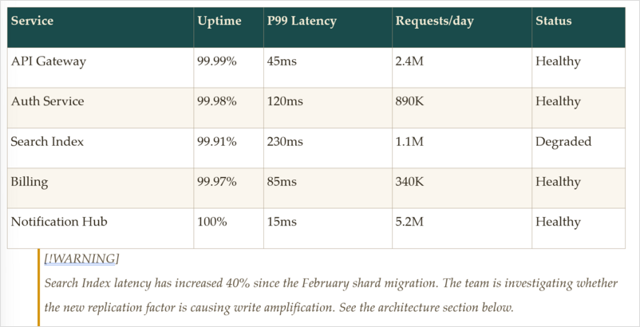

# md2

A CLI toolkit that converts Markdown to polished **DOCX** and **PPTX** files. Pipeline architecture with AST transforms, syntax highlighting, Mermaid diagrams, LaTeX math, and a YAML theme DSL.



[See how md2 compares to pandoc.](docs/md2_vs_pandoc.md)

## Features

- **Rich formatting** — headings, bold, italic, strikethrough, inline code, links, images
- **Tables** — auto-sizing columns, header styling, alternating row shading, borders, inline formatting in cells
- **Lists** — numbered, bulleted, nested, task lists with checkboxes
- **Code blocks** — syntax highlighting for 20+ languages via TextMateSharp, mono font with background shading
- **Mermaid diagrams** — rendered to high-resolution PNG via Playwright, content-hash caching
- **Math equations** — LaTeX to native Word OMML via KaTeX, inline and display math
- **Smart typography** — curly quotes, em/en dashes, ellipses (code spans excluded)
- **Images** — embedded with aspect-ratio-preserving scaling, alt text, missing-file placeholders
- **Blockquotes & admonitions** — colored borders, typed callouts (note/warning/tip/important/caution)
- **Footnotes** — superscript references with bidirectional navigation
- **Front matter** — YAML metadata (title, author, date) flows into document properties
- **Page layout** — configurable margins, page size, page numbers in footer, widow/orphan control
- **Theme engine** — YAML theme DSL with 4-layer cascade (CLI > theme > preset > template), built-in presets, schema validation
- **Live preview** — hot-reloading HTML preview with theme support
- **Table of contents** — auto-generated from headings with configurable depth
- **Cover pages** — generated from front matter metadata

### PPTX Output (v2)

- **MARP-compatible input** — write slides in standard [MARP](https://marp.app/) Markdown syntax
- **Slide layouts** — title, content, section-divider, two-column, blank (auto-inferred from content)
- **Theme integration** — shared theme DSL with `pptx:` section for PPTX-specific styling
- **Speaker notes** — preserved from MARP `<!-- notes -->` syntax
- **Headers/footers** — from MARP `header`/`footer` directives
- **Slide numbers** — via `paginate: true` directive
- **Native tables** — theme-styled with header rows and alternating shading
- **Code blocks** — with background fill, border, padding
- **Build animations** — click-to-reveal bullet lists via `<!-- md2: { build: "bullets" } -->`
- **Background images** — `` with path safety
- **Inline images** — aspect-ratio scaling with PNG/JPEG dimension reading
- **Blockquotes** — styled with italic text and left border bar
- **Hyperlinks** — clickable links in PPTX text
- **Native Mermaid flowcharts** — flowchart/graph diagrams rendered as editable PPTX shapes
- **Mermaid image fallback** — complex diagrams (sequence, Gantt, ER) fall back to PNG
- **Native PPTX charts** — bar, column, line, pie charts from `chart` code fences (editable in PowerPoint)
- **Fit headings** — `<!-- fit -->` auto-scale headings

## Prerequisites

- [.NET 9 SDK](https://dotnet.microsoft.com/download/dotnet/9.0)
- Chromium (for Mermaid diagrams and math equations — installed automatically via Playwright on first use)

## Build

```bash
dotnet build
```

## Usage

```bash
# Convert input.md to input.docx (output name derived from input)
dotnet run --project src/Md2.Cli -- input.md

# Specify output path
dotnet run --project src/Md2.Cli -- input.md -o report.docx

# Convert MARP slides to PPTX (auto-detected from .pptx extension)
dotnet run --project src/Md2.Cli -- slides.md -o slides.pptx

# Use a theme preset
dotnet run --project src/Md2.Cli -- input.md --preset default

# Apply style overrides
dotnet run --project src/Md2.Cli -- input.md --style colors.primary=FF0000 --style docx.baseFontSize=14

# Use a custom theme YAML
dotnet run --project src/Md2.Cli -- input.md --theme mytheme.yaml

# Use a DOCX template for base styling
dotnet run --project src/Md2.Cli -- input.md --template corporate.docx

# Include a table of contents
dotnet run --project src/Md2.Cli -- input.md --toc --toc-depth 2

# Include a cover page from front matter metadata
dotnet run --project src/Md2.Cli -- input.md --cover

# Verbose output (shows cascade resolution, timing, stack traces)
dotnet run --project src/Md2.Cli -- input.md -v

# Quiet mode (suppress warnings)
dotnet run --project src/Md2.Cli -- input.md -q
```

The output path is printed to stdout, so you can pipe it:

```bash
open "$(dotnet run --project src/Md2.Cli -- notes.md)"
```

### Preview

Open a live HTML preview with hot-reloading. Watches the source file for changes and refreshes automatically.

```bash
# Live preview in browser
dotnet run --project src/Md2.Cli -- preview input.md

# Preview with a specific theme
dotnet run --project src/Md2.Cli -- preview input.md --preset modern

# Start server without opening browser (useful with port forwarding)
dotnet run --project src/Md2.Cli -- preview input.md --no-browser
```

### Doctor

Check that the md2 environment and dependencies are properly configured.

```bash
dotnet run --project src/Md2.Cli -- doctor
```

### Theme Commands

```bash
# List available presets
dotnet run --project src/Md2.Cli -- theme list

# Inspect resolved theme with cascade layer attribution
dotnet run --project src/Md2.Cli -- theme resolve --preset modern

# Resolve with all cascade layers
dotnet run --project src/Md2.Cli -- theme resolve --preset default --theme overrides.yaml --style colors.primary=FF0000

# Validate a theme YAML file
dotnet run --project src/Md2.Cli -- theme validate mytheme.yaml

# Extract styles from a DOCX template into a theme YAML
dotnet run --project src/Md2.Cli -- theme extract corporate.docx -o extracted.yaml
```

## Example

Given this Markdown:

```markdown
---
title: Project Report
author: Jane Doe
date: 2026-03-12
---

# Summary

This report covers **Q1 results** with *key metrics* below.

| Metric | Target | Actual |
|--------|--------|--------|
| Revenue | $1M | $1.2M |
| Users | 10k | 12.5k |

## Next Steps

1. Expand to new markets
2. Launch mobile app
3. Hire 5 engineers
```

Run:

```bash
dotnet run --project src/Md2.Cli -- report.md -o report.docx
```

The output DOCX has styled headings, formatted table with auto-sized columns and header row, numbered list, and document properties from front matter.

## Tests

```bash
dotnet test
```

## Project Structure

```
src/
  Md2.Cli/          — CLI entry point (System.CommandLine)
  Md2.Core/         — Pipeline orchestration, transforms, shared types
  Md2.Parsing/      — Markdig configuration and extensions
  Md2.Emit.Docx/    — DOCX emitter (Open XML SDK)
  Md2.Emit.Pptx/    — PPTX emitter with native charts and Mermaid shapes
  Md2.Slides/       — MARP parser (directives, slide splitting, layout inference)
  Md2.Highlight/    — Syntax highlighting (TextMateSharp)
  Md2.Themes/       — YAML theme DSL, cascade resolver, presets
  Md2.Diagrams/     — Mermaid diagram rendering (Playwright)
  Md2.Math/         — LaTeX math to OMML conversion
  Md2.Preview/      — Live HTML preview server with hot-reload
tests/
  Md2.Core.Tests/
  Md2.Parsing.Tests/
  Md2.Emit.Docx.Tests/
  Md2.Emit.Pptx.Tests/
  Md2.Slides.Tests/
  Md2.Themes.Tests/
  Md2.Highlight.Tests/
  Md2.Diagrams.Tests/
  Md2.Math.Tests/
  Md2.Preview.Tests/
  Md2.Integration.Tests/
```

## Contributing

Contributions welcome! See [CONTRIBUTING.md](CONTRIBUTING.md) for guidelines.

## License

[MIT](LICENSE)
