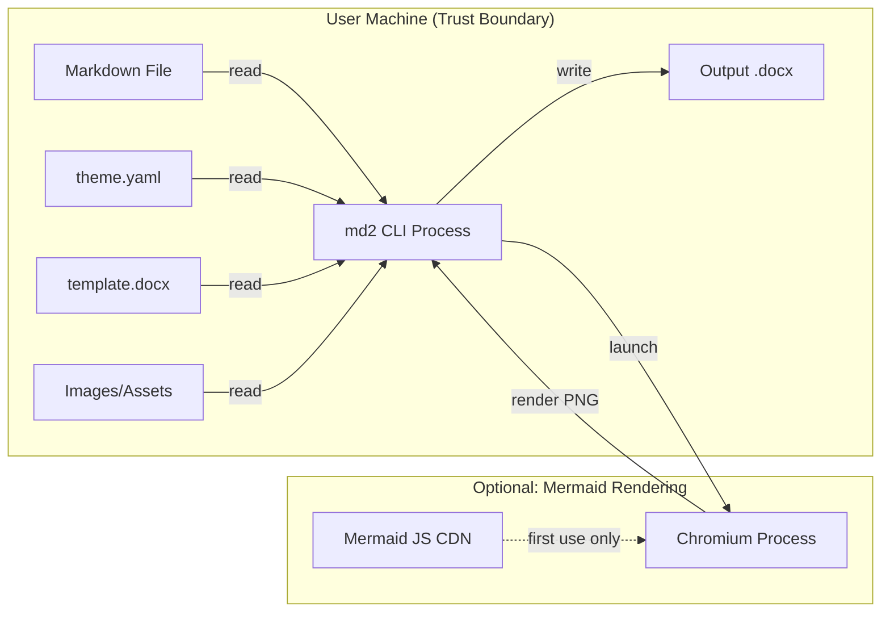
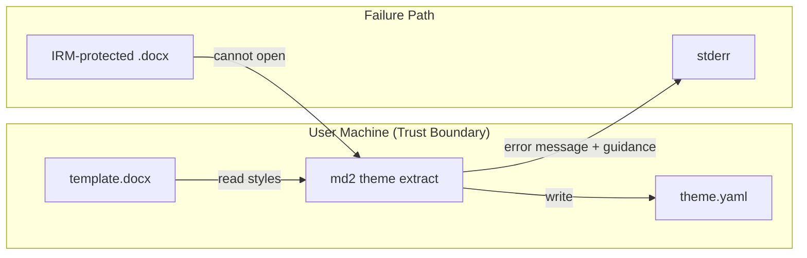
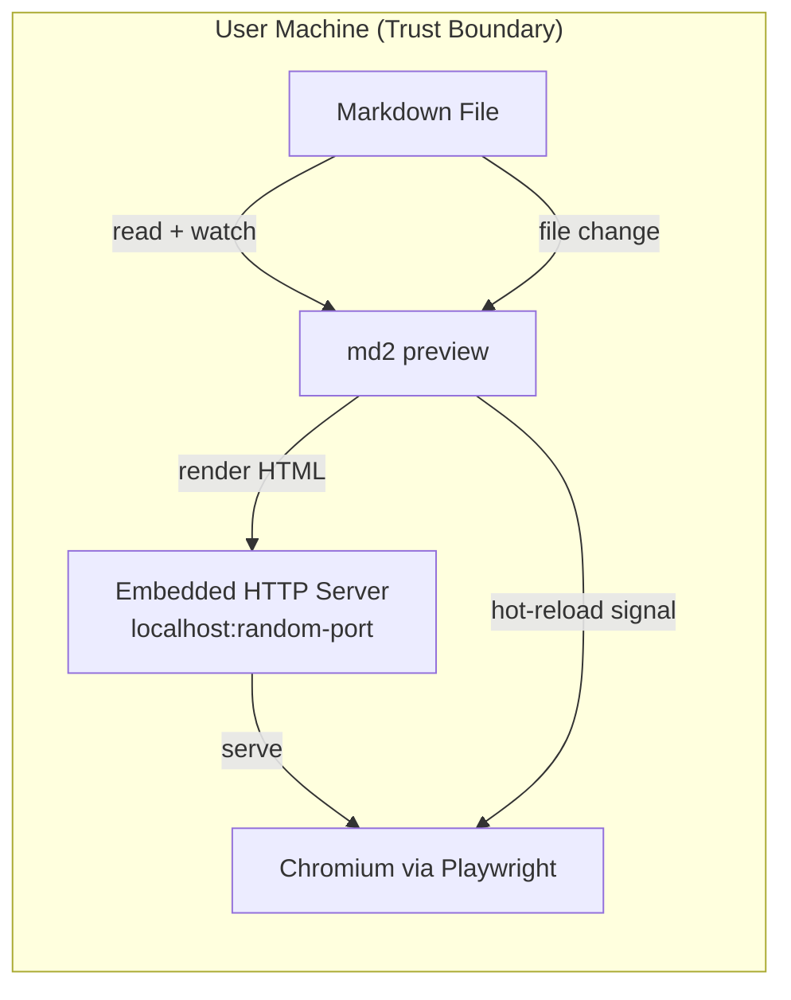

---
agent-notes:
  ctx: "high-level architecture for md2 CLI toolkit"
  deps: [CLAUDE.md, docs/product-context.md, docs/tracking/2026-03-11-md2doc-discovery.md]
  state: active
  last: "archie@2026-03-11"
  key: ["pipeline arch: Parse>AST>Transform>Style>Emit", "YAML theme DSL with 4-layer cascade", "PPTX seam via emitter abstraction"]
---

# md2 -- High-Level Architecture

**Author:** Archie (lead architect)
**Date:** 2026-03-11
**Status:** Proposed -- pending human confirmation

## 1. Architecture at a Glance

```
                          theme.yaml    template.docx     --style overrides
                              |              |                   |
                              v              v                   v
                        +---------------------------------------------+
                        |           Style Resolution Engine            |
                        |  (4-layer cascade: CLI > YAML > preset >    |
                        |   template styles, with gap warnings)       |
                        +---------------------------------------------+
                                           |
                                    ResolvedTheme
                                           |
                                           v
+----------+    +-----------+    +------------------+    +-----------+
| Markdown |    |  Markdig  |    |   AST Transform  |    |  Format   |
|  Input   +--->+  Parser   +--->+     Pipeline      +--->+  Emitter |---> .docx / .pptx
| (.md)    |    | (CommonMark|   | (smart typography,|    | (OpenXML) |
+----------+    |  + GFM +  |    |  TOC gen, cover   |    +-----------+
                |  extensions|   |  page, math parse,|
                +-----------+    |  mermaid render,  |
                      |          |  cross-refs)      |
                      v          +------------------+
               MarkdownDocument
               (Markdig AST)

Pipeline inspection:
  --dry-run              stops before Emit, prints summary
  --stage parse --emit json   dumps AST as JSON after Parse
  --stage transform --emit json   dumps AST after Transforms
```

**Key architectural decision:** We use Markdig's native AST (`MarkdownDocument`) directly rather than defining a custom intermediate representation. Markdig's AST is rich, extensible via `MarkdownObject.GetData()`/`SetData()`, and carries precise source positions. A custom IR would add a translation layer with no clear benefit for our use case. If PPTX requires structural transformations that diverge significantly from the DOCX path (e.g., slide chunking), those transformations operate on the same Markdig AST before it reaches the format-specific emitter.

## 2. Solution Structure

```
md2.sln
|
+-- src/
|   +-- Md2.Cli/                  Console app, entry point, System.CommandLine
|   +-- Md2.Core/                 Pipeline orchestration, AST transforms, shared types
|   +-- Md2.Parsing/              Markdig pipeline config, extension registration, front matter
|   +-- Md2.Themes/               YAML theme DSL, cascade resolver, preset definitions
|   +-- Md2.Emit.Docx/            DOCX emitter (Open XML SDK), style mapping
|   +-- Md2.Emit.Pptx/            PPTX emitter (Open XML SDK) -- v2, stubbed
|   +-- Md2.Highlight/            Syntax highlighting (TextMateSharp), produces styled token runs
|   +-- Md2.Math/                 LaTeX -> OOXML math conversion
|   +-- Md2.Diagrams/             Mermaid rendering via Playwright for .NET
|   +-- Md2.Preview/              HTML preview with hot-reload via Playwright
|
+-- tests/
|   +-- Md2.Core.Tests/
|   +-- Md2.Parsing.Tests/
|   +-- Md2.Themes.Tests/
|   +-- Md2.Emit.Docx.Tests/
|   +-- Md2.Highlight.Tests/
|   +-- Md2.Math.Tests/
|   +-- Md2.Diagrams.Tests/       (integration tests, require Chromium)
|   +-- Md2.Preview.Tests/        (integration tests, require Chromium)
|   +-- Md2.Integration.Tests/    End-to-end: .md in, .docx out, validate with Open XML SDK
|
+-- presets/
|   +-- default.yaml
|   +-- technical.yaml
|   +-- corporate.yaml
|   +-- academic.yaml
|   +-- minimal.yaml
|
+-- docs/
```

### Dependency Graph

```
Md2.Cli
  +-- Md2.Core
  +-- Md2.Emit.Docx
  +-- Md2.Emit.Pptx (v2)
  +-- Md2.Preview
  +-- Md2.Diagrams

Md2.Core
  +-- Md2.Parsing
  +-- Md2.Themes
  +-- Md2.Highlight
  +-- Md2.Math
  +-- Md2.Diagrams (via interface, not direct reference)

Md2.Parsing
  +-- Markdig (NuGet)
  +-- YamlDotNet (NuGet, for front matter)

Md2.Themes
  +-- YamlDotNet (NuGet)

Md2.Emit.Docx
  +-- Md2.Core (for pipeline types, ResolvedTheme, AST traversal)
  +-- DocumentFormat.OpenXml (NuGet)

Md2.Emit.Pptx
  +-- Md2.Core
  +-- DocumentFormat.OpenXml (NuGet)

Md2.Highlight
  +-- TextMateSharp (NuGet)

Md2.Math
  (no external deps -- custom LaTeX-to-OMML converter; see ADR-0006)

Md2.Diagrams
  +-- Microsoft.Playwright (NuGet)

Md2.Preview
  +-- Microsoft.Playwright (NuGet)
  +-- Md2.Core
```

**Design principle:** The emitter projects (`Md2.Emit.Docx`, `Md2.Emit.Pptx`) depend on `Md2.Core` but `Md2.Core` does NOT depend on any emitter. The CLI project wires emitters via the `IFormatEmitter` interface. This is the primary seam for PPTX support: implement `IFormatEmitter` in a new assembly and register it.

## 3. Core Types and Pipeline Flow

### 3.1 Pipeline Orchestration

```csharp
// Md2.Core
namespace Md2.Core.Pipeline;

public sealed class ConversionPipeline
{
    // Phases execute in order. Each is independently testable.
    public MarkdownDocument Parse(string markdown, ParserOptions options);
    public MarkdownDocument Transform(MarkdownDocument doc, TransformOptions options);
    public ResolvedTheme ResolveStyles(ThemeCascadeInput input);
    public void Emit(MarkdownDocument doc, ResolvedTheme theme, IFormatEmitter emitter, Stream output);
}

public record ParserOptions(
    bool EnableGfm = true,
    bool EnableMath = true,
    bool EnableAdmonitions = true,
    bool EnableDefinitionLists = true,
    bool EnableAttributes = true,
    bool EnableYamlFrontMatter = true
);

public record TransformOptions(
    bool SmartTypography = true,
    bool GenerateToc = false,
    bool GenerateCoverPage = false,
    bool RenderMermaid = true,
    // ... etc
);
```

### 3.2 Format Emitter Interface

```csharp
// Md2.Core
namespace Md2.Core.Emit;

public interface IFormatEmitter
{
    string FormatName { get; }             // "docx", "pptx"
    IReadOnlyList<string> FileExtensions { get; }  // [".docx"], [".pptx"]

    /// Emit the transformed AST to the output stream using the resolved theme.
    Task EmitAsync(
        MarkdownDocument document,
        ResolvedTheme theme,
        EmitOptions options,
        Stream output,
        CancellationToken ct = default
    );
}

public record EmitOptions(
    string? TemplatePath = null,    // Custom DOCX/PPTX template
    bool IncludeToc = false,
    bool IncludeCoverPage = false,
    PageSize PageSize = PageSize.A4,
    Margins Margins = default
    // Format-specific options live in subclasses
);
```

### 3.3 Style Resolution (4-Layer Cascade)

```
Layer 4 (highest priority):  --style "heading1.fontSize=28pt" (CLI overrides)
Layer 3:                     theme.yaml (user's YAML theme file)
Layer 2:                     preset defaults (e.g., "technical" preset YAML)
Layer 1 (lowest priority):   template.docx embedded styles (extracted at runtime)
```

```csharp
// Md2.Themes
namespace Md2.Themes;

public sealed class ThemeCascadeResolver
{
    /// Resolve the final theme by merging all layers.
    /// Returns the merged theme AND a list of warnings for gaps
    /// (styles present in the AST but absent from all layers).
    public (ResolvedTheme Theme, IReadOnlyList<StyleWarning> Warnings)
        Resolve(ThemeCascadeInput input);
}

public record ThemeCascadeInput(
    ThemeDefinition? YamlTheme,           // From --theme flag
    string? PresetName,                    // From --preset flag
    string? TemplatePath,                  // From --template flag
    IReadOnlyList<StyleOverride>? CliOverrides  // From --style flags
);

public record StyleWarning(
    string StyleName,
    string Message,     // e.g., "Heading4 not defined in template; using preset default"
    StyleWarningLevel Level  // Info, Warning
);
```

### 3.4 Theme YAML Structure

```yaml
# theme.yaml -- shared + format-specific sections
meta:
  name: "Corporate Blue"
  description: "Professional style for corporate reports"
  version: 1

# Shared tokens (used by all format emitters)
typography:
  headingFont: "Calibri"
  bodyFont: "Cambria"
  monoFont: "Cascadia Code"
  baseFontSize: 11pt
  lineSpacing: 1.15

colors:
  primary: "#1B3A5C"
  secondary: "#4A90D9"
  accent: "#E67E22"
  text: "#333333"
  lightText: "#666666"
  codeBg: "#F5F5F5"
  admonitionNote: "#4A90D9"
  admonitionWarning: "#E67E22"
  admonitionTip: "#27AE60"
  admonitionImportant: "#E74C3C"

# Format-specific overrides
docx:
  pageSize: A4
  margins: { top: 1in, bottom: 1in, left: 1.25in, right: 1.25in }
  heading1: { fontSize: 28pt, bold: true, color: "${colors.primary}", spaceBefore: 24pt, spaceAfter: 6pt }
  heading2: { fontSize: 22pt, bold: true, color: "${colors.primary}", spaceBefore: 18pt, spaceAfter: 4pt }
  heading3: { fontSize: 16pt, bold: true, color: "${colors.secondary}", spaceBefore: 12pt, spaceAfter: 4pt }
  heading4: { fontSize: 13pt, bold: true, italic: true, color: "${colors.secondary}" }
  body: { fontSize: "${typography.baseFontSize}", font: "${typography.bodyFont}", lineSpacing: "${typography.lineSpacing}" }
  blockquote: { leftBorderColor: "${colors.secondary}", leftBorderWidth: 3pt, italic: true, leftIndent: 0.5in }
  code:
    font: "${typography.monoFont}"
    fontSize: 9.5pt
    background: "${colors.codeBg}"
    border: { color: "#E0E0E0", width: 0.5pt }
  table:
    headerBg: "${colors.primary}"
    headerFg: "#FFFFFF"
    alternateRowBg: "#F8F9FA"
    borderColor: "#DEE2E6"
    borderWidth: 0.5pt
  header: { text: "${meta.name}", font: "${typography.bodyFont}", fontSize: 8pt }
  footer: { pageNumbers: true, style: "Page {page} of {pages}" }

# PPTX section -- v2, same shared tokens
# pptx:
#   slideSize: widescreen
#   titleSlide: { ... }
#   contentSlide: { ... }
```

### 3.5 AST Transform Pipeline

Transforms are ordered and composable. Each transform is a visitor over the Markdig AST.

```csharp
// Md2.Core
namespace Md2.Core.Transforms;

public interface IAstTransform
{
    string Name { get; }
    int Order { get; }  // Lower runs first
    MarkdownDocument Transform(MarkdownDocument doc, TransformContext context);
}

// Concrete transforms (executed in Order):
// 010 - YamlFrontMatterExtractor    extracts front matter into TransformContext.Metadata
// 020 - SmartTypographyTransform    curly quotes, em-dashes, ellipses
// 030 - MathBlockAnnotator          identifies LaTeX blocks, annotates AST nodes
// 040 - MermaidDiagramRenderer      renders mermaid code blocks to PNG, replaces with image refs
// 050 - SyntaxHighlightAnnotator    tokenizes code blocks, attaches styled runs to AST
// 060 - TocGenerator                builds TOC structure from heading nodes
// 070 - CoverPageGenerator          generates cover page block from front matter
// 080 - CrossReferenceLinker        resolves internal [#heading] links to anchor targets
// 090 - AdmonitionTransform         normalizes admonition syntax into typed blocks
```

### 3.6 DOCX Emitter Architecture

The DOCX emitter walks the (transformed) Markdig AST using a visitor pattern, building Open XML elements.

```csharp
// Md2.Emit.Docx
namespace Md2.Emit.Docx;

public sealed class DocxEmitter : IFormatEmitter
{
    public string FormatName => "docx";
    public IReadOnlyList<string> FileExtensions => [".docx"];

    public async Task EmitAsync(
        MarkdownDocument document,
        ResolvedTheme theme,
        EmitOptions options,
        Stream output,
        CancellationToken ct = default)
    {
        // 1. Create or open template WordprocessingDocument
        // 2. Apply/merge styles from ResolvedTheme into document styles part
        // 3. Walk AST with DocxAstVisitor, appending OpenXml elements
        // 4. Save to output stream
    }
}

/// Walks Markdig AST, produces OpenXml Body content.
/// One Visit method per AST node type (HeadingBlock, ParagraphBlock, etc.)
internal sealed class DocxAstVisitor
{
    // Delegates to specialized builders:
    //   ParagraphBuilder  -- headings, body text, blockquotes
    //   TableBuilder      -- GFM tables with auto-sizing
    //   ListBuilder       -- nested lists, task lists
    //   CodeBlockBuilder  -- syntax-highlighted code with background
    //   ImageBuilder      -- embedded images with aspect ratio
    //   MathBuilder       -- OOXML math elements
    //   AdmonitionBuilder -- styled callout boxes
    //   FootnoteBuilder   -- footnotes with bidirectional links
}
```

## 4. CLI Design

```
md2 <input.md> [options]         # Format inferred from -o extension (default: .docx)
md2 <input.md> -o report.docx    # Explicit output
md2 <input.md> -o slides.pptx    # PPTX (v2)
md2 preview <input.md>           # Hot-reload preview
md2 theme extract <template.docx> -o theme.yaml    # Extract theme from DOCX
md2 theme validate <theme.yaml>  # Validate theme YAML
md2 theme list                   # List built-in presets

Options:
  -o, --output <path>         Output file path (required unless --dry-run or preview)
  --preset <name>             Built-in style preset (default, technical, corporate, academic, minimal)
  --theme <path>              Custom YAML theme file
  --template <path>           Custom DOCX template (cascade with warnings)
  --style <prop=value>        Surgical style override (repeatable)
  --toc                       Generate table of contents
  --cover                     Generate cover page from front matter
  --dry-run                   Parse and transform only, print summary
  --stage <parse|transform>   Stop at stage, combine with --emit
  --emit <json|summary>       Output format for --stage
  --no-mermaid                Disable Mermaid rendering
  --mermaid-scale <float>     Mermaid DPI scale factor (default: 2.0)
  -v, --verbose               Verbose output (show style warnings, timing)
  -q, --quiet                 Suppress warnings
```

**CLI framework:** `System.CommandLine` (Microsoft's official .NET CLI library). Mature, supports completion, help generation, middleware.

## 5. Data Flow Diagrams (for threat model)

### 5.1 Standard Conversion Flow



### 5.2 Theme Extraction Flow



### 5.3 Preview Flow



**Trust boundaries for Pierrot to annotate:**
- All I/O is local filesystem. No network except optional first-use Chromium download and preview localhost.
- Chromium process is sandboxed by Playwright.
- Template DOCX files are untrusted input (could be malformed/malicious XML).
- Mermaid code blocks are untrusted input (rendered in sandboxed Chromium).
- YAML theme files are untrusted input (parsed with YamlDotNet, which needs safe loading mode).

## 6. Key Technology Decisions (ADR Summary)

Each of these is written as a full ADR in `docs/adrs/`. Summary table here for reference:

| ADR | Decision | Status |
|-----|----------|--------|
| 0003 | Use Markdig as the Markdown parser | Proposed |
| 0004 | Use Open XML SDK for DOCX/PPTX generation | Proposed |
| 0005 | Use Markdig's native AST (no custom IR) | Proposed |
| 0006 | Custom LaTeX-to-OMML converter (no external dependency) | Proposed |
| 0007 | Use TextMateSharp for syntax highlighting | Proposed |
| 0008 | Use Playwright for .NET for Mermaid rendering | Proposed |
| 0009 | YAML theme DSL with YamlDotNet and 4-layer cascade | Proposed |
| 0010 | Fail-fast with guidance for IRM-protected templates | Proposed |
| 0011 | Use System.CommandLine for CLI framework | Proposed |

## 7. Risks and Unknowns

### 7.1 High Risk

**R1: LaTeX-to-OMML fidelity.** There is no mature C#-native library for LaTeX-to-OMML conversion. The Haskell `texmath` library (used by pandoc) is the gold standard but cannot be consumed from .NET without interop pain. We must build a custom converter targeting a pragmatic subset of LaTeX math. **Mitigation:** Prototype early. Define the supported LaTeX subset explicitly. Fall back to rendering math as high-res PNG via Playwright + KaTeX if the OMML path proves too complex for advanced expressions.

**R2: Table auto-sizing in DOCX.** Open XML SDK provides no layout engine. Column widths must be calculated manually based on content. Getting this right for complex tables (merged cells, long content, nested elements) is non-trivial. **Mitigation:** Start with percentage-based column widths derived from content heuristics. Prototype with real-world tables early.

**R3: Mermaid rendering cold-start.** First Chromium download is ~300MB. First render spins up a browser process. This can surprise users. **Mitigation:** Mermaid is opt-in. First-use downloads Chromium with a progress bar and explicit consent. Cache the browser instance across multiple diagrams in a single run.

### 7.2 Medium Risk

**R4: Theme extraction accuracy.** DOCX style definitions are complex (inheritance, latent styles, default styles, theme colors vs. explicit colors). Extracting a clean YAML theme from an arbitrary DOCX template may produce incomplete or surprising results. **Mitigation:** Extraction is best-effort with warnings. The YAML output includes comments explaining what was inferred vs. what was explicit.

**R5: Cross-platform font availability.** DOCX references fonts by name. If the font is not installed on the target system (e.g., Linux), Word/LibreOffice substitutes. **Mitigation:** Document recommended fonts. Presets use widely available fonts (Calibri, Cambria, Cascadia Code). Theme YAML supports font fallback chains.

**R6: Playwright for .NET versioning.** Playwright pins to specific Chromium versions. Version mismatches between NuGet package and installed browser cause failures. **Mitigation:** Pin Playwright version. Use `playwright install chromium` as a documented setup step.

### 7.3 Low Risk (but worth tracking)

**R7: Markdig extension gaps.** Markdig supports most extensions we need, but admonitions may require a custom extension. **Mitigation:** Markdig's extension API is well-documented. Writing a custom block parser for admonition syntax is straightforward.

**R8: YAML front matter schema evolution.** As we add features (cover page fields, TOC options, per-document style overrides), the front matter schema grows. **Mitigation:** Version the schema. Validate with a JSON Schema or Pydantic-style validator in C# (use `System.ComponentModel.DataAnnotations` or a dedicated library).

### 7.4 Prototyping Priorities

Before committing to full implementation, prototype these in isolation:

1. **LaTeX-to-OMML subset** -- Can we handle fractions, superscripts, subscripts, Greek letters, summation, integrals, matrices? How much of the LaTeX math universe do we need?
2. **Table auto-sizing** -- Feed 10 representative Markdown tables through Open XML SDK and manually inspect results in Word.
3. **Theme extraction** -- Take 3-5 real corporate DOCX templates and see what the extraction produces. Identify the failure modes.
4. **Syntax highlighting to DOCX runs** -- Verify that TextMateSharp token colors map cleanly to Open XML run properties.

## 8. IRM/DRM-Protected Template Handling

### Technical Reality

IRM (Information Rights Management) protected DOCX files are encrypted at the file level. The Open XML SDK cannot open them -- it will throw an `OpenXmlPackageException` because the underlying ZIP structure is replaced with an OLE compound document containing encrypted streams. There is no way to extract styles without decryption, and decryption requires authentication against an Active Directory/Azure RMS server with appropriate credentials.

### Design Decision

**Fail fast with clear guidance.** When `md2 theme extract` encounters an IRM-protected file:

1. **Detect early.** Check the file header before attempting Open XML parsing. IRM-protected files have a different magic number (OLE compound document `D0 CF 11 E0` vs. ZIP `50 4B 03 04`).
2. **Report clearly.** Print a specific error message:
   ```
   Error: Cannot extract theme from 'corp-template.docx' -- file is IRM/DRM protected.

   IRM-protected documents are encrypted and cannot be read without authentication
   against your organization's rights management server.

   To use this template with md2:
     1. Open the file in Microsoft Word (with appropriate permissions)
     2. File > Info > Protect Document > Restrict Access > Unrestricted Access
     3. Save the unprotected copy
     4. Run: md2 theme extract <unprotected-copy.docx> -o theme.yaml

   Alternatively, use a built-in preset: md2 report.md --preset corporate -o report.docx
   ```
3. **Exit code.** Return a distinct exit code (e.g., 2 for "protected file") so scripting can distinguish this from other errors.
4. **No silent degradation.** Do not attempt to partially extract, guess styles, or fall back to defaults without telling the user.

### Additional Template Safety

Even unprotected DOCX files are untrusted input:
- **Malformed XML:** The Open XML SDK handles this, but we wrap all template operations in try/catch with clear error messages.
- **Macro-enabled files (.docm):** Warn and refuse by default. Macros are irrelevant to style extraction and could indicate a malicious file.
- **Very large templates:** Set a size limit (e.g., 50MB) to avoid memory issues during extraction.

## 9. Future: PPTX Architecture Seam

The PPTX emitter is v2 but the architecture must not paint us into a corner.

**Seam points:**

1. **`IFormatEmitter` interface.** The PPTX emitter implements this interface, same as DOCX. The CLI dispatches based on output file extension.

2. **Slide-chunking transform.** PPTX needs an AST transform that chunks content into slides. This lives in `Md2.Core.Transforms` as `SlideChunkingTransform`, activated only when the target format is PPTX. It reads MARP-style `---` slide breaks or auto-chunks by heading level.

3. **Theme YAML `pptx:` section.** The theme schema already has a `pptx:` section. The cascade resolver handles both `docx:` and `pptx:` sections, selecting based on target format.

4. **Shared code.** Typography, color resolution, image handling, and math rendering are shared between DOCX and PPTX emitters via `Md2.Core`. Only the OpenXML element construction differs.

## 10. Performance Considerations

- **Parsing is fast.** Markdig parses megabytes of Markdown in milliseconds. Not a concern.
- **Mermaid rendering is slow.** Browser startup + rendering. Mitigate by: (a) parallelizing multiple diagrams, (b) caching rendered PNGs by content hash, (c) making it opt-in.
- **Syntax highlighting is moderate.** TextMateSharp loads grammars lazily. First highlight for a language incurs grammar parse cost. Subsequent highlights reuse the grammar.
- **DOCX generation is I/O-bound.** Open XML SDK writes to a ZIP stream. For large documents with many images, the bottleneck is image compression and ZIP writes.
- **Preview hot-reload should be <500ms** for re-parse + re-render of the HTML representation.

## 11. Testing Strategy Outline

| Layer | What | How |
|-------|------|-----|
| Unit | Individual transforms | Markdig AST in, transformed AST out. Assert node structure. |
| Unit | Style cascade resolver | Multiple theme layers in, merged theme out. Assert property values. |
| Unit | YAML theme parsing | YAML strings in, `ThemeDefinition` out. Cover variable interpolation. |
| Unit | LaTeX-to-OMML | LaTeX strings in, OMML XML out. Compare against known-good OMML. |
| Unit | Syntax highlight tokenizer | Code strings in, styled token lists out. |
| Integration | DOCX emitter | Markdown in, .docx out. Open with Open XML SDK, assert styles/content. |
| Integration | Theme extraction | .docx template in, .yaml out. Assert extracted values match template. |
| Integration | Mermaid rendering | Mermaid code in, PNG out. Assert image dimensions and non-empty. |
| E2E | Full pipeline | .md + theme + template in, .docx out. Open in Word, visual inspection. |
| Snapshot | Preset regression | Full preset + representative .md = .docx. Binary-diff against baseline. |

**Test framework:** xUnit (standard for .NET, integrates with CI). Fluent assertions via FluentAssertions or Shouldly.
