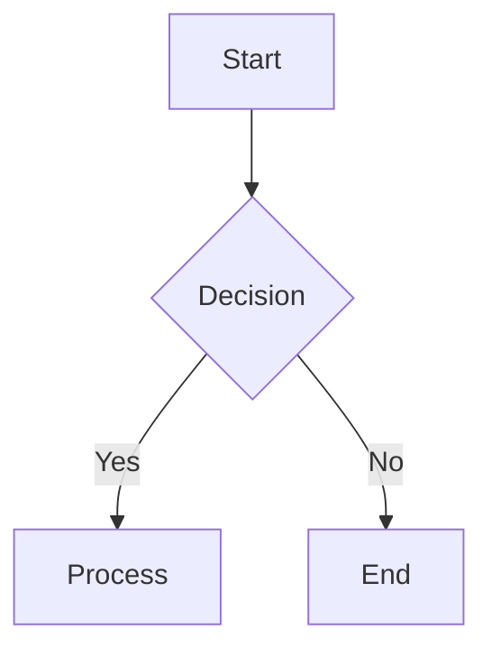

# MARP Compatibility

md2 accepts [MARP](https://marp.app/)-styled Markdown as input for PPTX output. This document lists supported features, caveats, and md2-specific extensions.

## Supported MARP Features

### Directives

| Directive | Scope | Support | Notes |
|-----------|-------|---------|-------|
| `theme` | Global | Mapped | Maps to md2 preset hint (gaia→default, uncover→modern) |
| `class` | Local/Scoped | Parsed | Used for layout inference |
| `backgroundColor` | Local/Scoped | Full | Hex colors applied to slide background |
| `backgroundImage` | Local/Scoped | Full | Local files only (no remote URLs) |
| `color` | Local/Scoped | Parsed | Cascaded to slides |
| `header` | Global/Scoped | Full | Rendered as top-of-slide text shape |
| `footer` | Global/Scoped | Full | Rendered as bottom-of-slide text shape |
| `paginate` | Global/Scoped | Full | Shows "N / Total" slide numbers |
| `_paginate` | Local | Full | Per-slide override |
| `headingDivider` | Global | Full | Auto-split slides at heading levels |

### Slide Splitting

- Horizontal rules (`---`) split slides (standard MARP behavior)
- `headingDivider` directive splits at specified heading levels
- Front matter (`---\n...\n---`) is extracted as metadata, not treated as a slide break

### Markdown Content

| Feature | Support | Notes |
|---------|---------|-------|
| Headings (H1-H6) | Full | Sized per theme, H1 auto-detected as title slide |
| Paragraphs | Full | Rich text with inline formatting |
| Bold/Italic/Strikethrough | Full | Mapped to PPTX text run properties |
| Inline code | Full | Rendered in monospace font |
| Links | Full | Clickable hyperlinks in PPTX |
| Ordered/unordered lists | Full | Bullet or numbered formatting |
| Tables | Full | Native PPTX tables with themed header/alternating rows |
| Code blocks | Full | Background fill, border, padding from theme |
| Blockquotes | Full | Italic text with left border bar |
| Images (``) | Full | PNG/JPEG with aspect-ratio scaling |
| `<!-- fit -->` headings | Full | Auto-shrink text to fit slide width |

### Image Syntax

| Syntax | Support | Notes |
|--------|---------|-------|
| `` | Full | Inline image |
| `` | Full | Background image (cover) |
| `` | Full | Background image (cover mode) |
| `` | Parsed | Background image |
| `` | Parsed | Split background (parsed, basic support) |
| `` | Parsed | Width hint |
| `` | Parsed | Height hint |

### Speaker Notes

Speaker notes are extracted from HTML comments at the end of a slide:

```markdown
# My Slide

Content here

<!-- This is a speaker note -->
```

Notes appear in the PPTX presenter view.

## md2 Extensions

md2 adds features beyond standard MARP via HTML comment extensions:

### Build Animations

```markdown
<!-- md2: { build: "bullets" } -->

- Point 1
- Point 2
- Point 3
```

Bullets appear one-by-one on click in presentation mode.

### Chart Code Fences

Native PPTX charts (editable in PowerPoint) via `chart` code fences:

````markdown
```chart
type: bar
title: Quarterly Revenue
labels: [Q1, Q2, Q3, Q4]
series:
- name: Revenue
  values: [100, 200, 300, 400]
- name: Costs
  values: [80, 120, 180, 250]
```
````

**Supported chart types:** `bar`, `column`, `line`, `pie`

**CSV format** (alternative):

````markdown
```chart
type: line
title: Monthly Data
---
Month,Revenue,Costs
Jan,100,80
Feb,200,120
Mar,300,180
```
````

Chart colors come from the theme's `pptx.chartPalette`.

### Native Mermaid Flowcharts

Mermaid `graph`/`flowchart` diagrams are rendered as native editable PPTX shapes:

````markdown

````

**Supported node shapes:** rectangle `[text]`, rounded `(text)`, diamond `{text}`, circle `((text))`, hexagon `{{text}}`

**Supported edge styles:** solid `-->`, dashed `-.->`, thick `==>`

Complex Mermaid diagrams (sequence, Gantt, ER, state, pie) fall back to embedded PNG images when the Mermaid rendering pipeline is available.

## Not Supported

These MARP features are not currently supported:

- `size` directive (slide size is controlled by the md2 theme)
- `@auto-scaling` (use `<!-- fit -->` instead)
- CSS custom properties / Marpit CSS themes
- HTML elements in slides (stripped)
- Multi-column via `<div>` tags
- Remote/URL images (only local files)
- Company logos in headers/footers (planned for v2.1)

## Theme Mapping

When a MARP deck includes a `theme:` directive, md2 maps it to the closest md2 preset:

| MARP Theme | md2 Preset | Notes |
|------------|------------|-------|
| `default` | `default` | Clean, professional |
| `gaia` | `default` | Similar styling |
| `uncover` | `modern` | Contemporary feel |

You can override the preset with `--preset <name>` on the command line.
