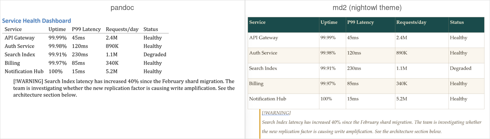
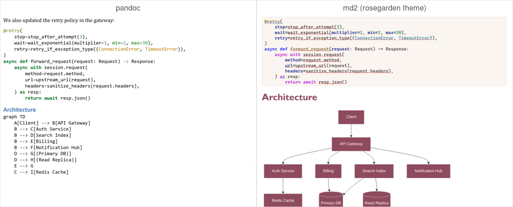

# md2 vs pandoc

Pandoc is a fantastic universal document converter. If you need to convert between dozens of formats, use pandoc. But if your goal is **Markdown to polished DOCX**, md2 exists because pandoc's Word output has real limitations that matter for professional documents.

## The short version

| Capability | md2 | pandoc |
|-----------|-----|--------|
| Table column sizing | Content-aware auto-sizing with min/max constraints | Fixed-width columns, often too wide or too narrow |
| Syntax highlighting | TextMateSharp (VS Code grammars), WCAG contrast enforcement | Basic or requires external filter |
| Math equations | Native OMML — editable in Word, not images | Images or limited MathML |
| Mermaid diagrams | High-res PNG rendering via Playwright | Not supported |
| Table of contents | Native OOXML field codes (updates when you open in Word) | Not supported |
| Cover pages | Generated from YAML front matter | Not supported |
| Theme system | 4-layer cascade (CLI > YAML > preset > template) with debug tracing | Limited reference-doc styling |
| Task lists | Checkbox rendering (☑ / ☐) | Not supported |
| Admonitions | Color-coded callout boxes (note/warning/tip/important/caution) | Not supported |
| Smart typography | Curly quotes, em/en dashes, ellipsis — with code-span exclusion | Partial |
| Image scaling | Aspect-ratio preserving, max-width aware, captions | Basic embedding |
| Footnotes | Superscript references with bidirectional bookmarks | Supported |

## Output comparison

### Tables and admonitions



### Code blocks and Mermaid diagrams



## Details

### Tables that don't look broken

Pandoc's DOCX tables use fixed column widths that frequently don't match the content — a column with one word gets the same width as a column with a paragraph. md2 measures content length per column, then proportionally allocates widths with min (5%) and max (60%) constraints. Headers repeat across page breaks. Alternating row shading and cell padding are applied automatically.

### Syntax highlighting that's actually readable

md2 uses TextMateSharp — the same grammar engine as VS Code — for syntax highlighting across 30+ languages. Each token gets precise color and style. A WCAG 3.0 contrast checker enforces a minimum 3:1 ratio against the code block background, flipping tokens to a readable fallback when needed. The result is code blocks that look good on screen and on paper.

### Math you can edit

Pandoc typically renders math as images. md2 converts LaTeX to native Office Math (OMML) through a pipeline: LaTeX → KaTeX → MathML → XSLT → OMML. The result is selectable, editable math in Word — not a rasterized image that breaks when you zoom in.

### Mermaid diagrams

Fenced code blocks with `mermaid` as the language get rendered to high-resolution PNG via Playwright. A SHA256 content-hash cache avoids re-rendering unchanged diagrams. Pandoc has no built-in Mermaid support.

### Styling without fighting Word

Pandoc's approach to DOCX styling is a reference document — you create a .docx with the styles you want and pass it as `--reference-doc`. This works but it's opaque, hard to version control, and you can't override individual properties.

md2's theme engine is a YAML DSL with a 4-layer cascade:

```
CLI --style overrides  (highest priority)
     ↓
theme.yaml             (your YAML theme file)
     ↓
preset                 (built-in: default, corporate, academic, technical, ...)
     ↓
template.docx          (lowest priority)
```

Override one property without clobbering the rest. Debug the cascade with `md2 theme resolve` to see exactly which layer each value came from. Validate themes before using them. Version-control your styles as plain text.

### Cover pages and TOC

md2 generates cover pages from YAML front matter (title, author, date, abstract) and inserts a native Word TOC using OOXML field codes that update when you open the document. Pandoc does neither.

### Admonitions

GitHub-style callouts like `> [!WARNING]` render as color-coded boxes with left borders and bold type labels. Pandoc passes these through as plain blockquotes.

## When to use pandoc instead

- You need to convert between formats other than Markdown → DOCX
- You need HTML, PDF, EPUB, LaTeX, or reStructuredText output
- You need Lua filters for custom processing
- You don't care about DOCX output polish

## Philosophy

md2's design principle is simple: **output quality is the product.** Every feature exists because pandoc's DOCX output fell short in a specific, concrete way. If the output isn't noticeably better, the tool has no reason to exist.
