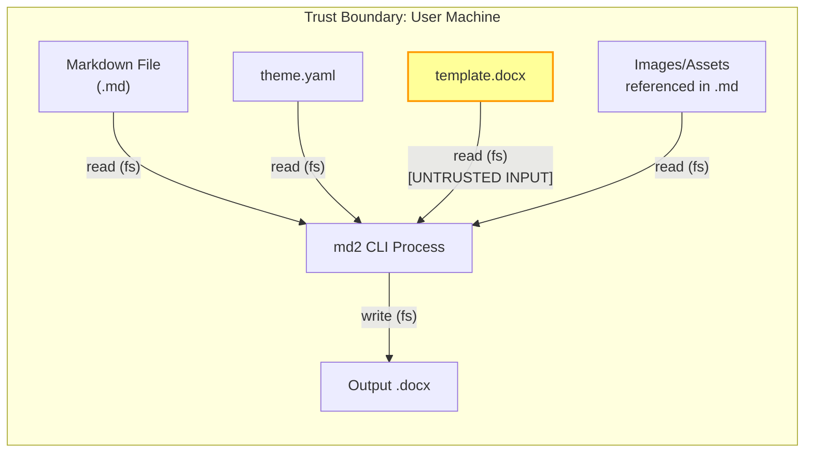
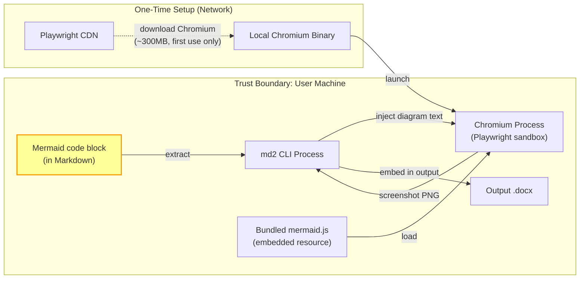
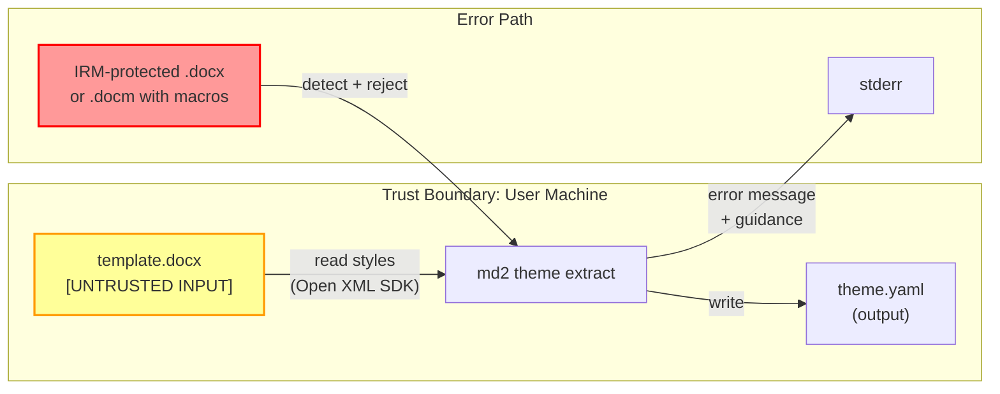
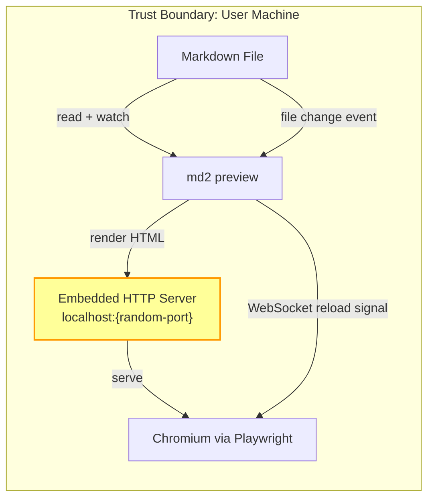
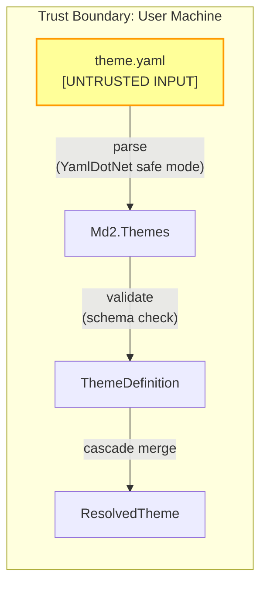
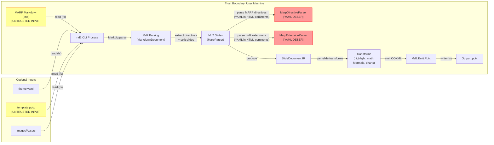
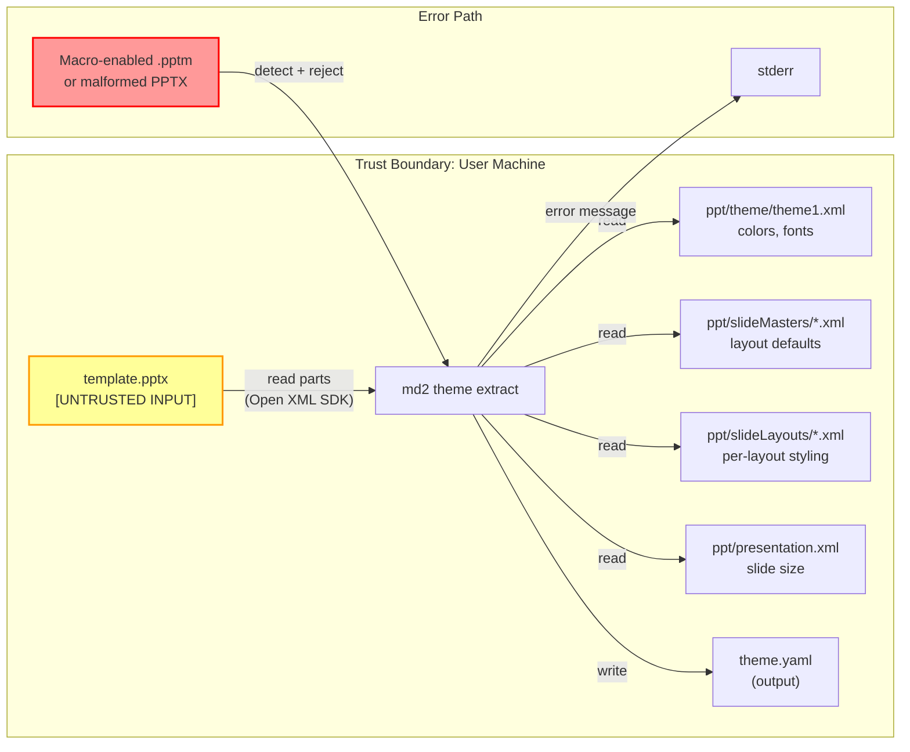
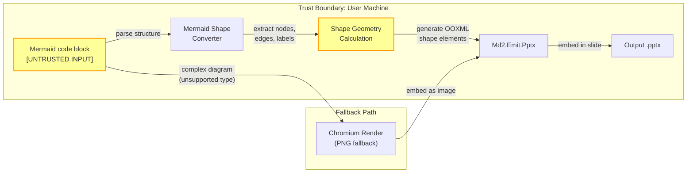
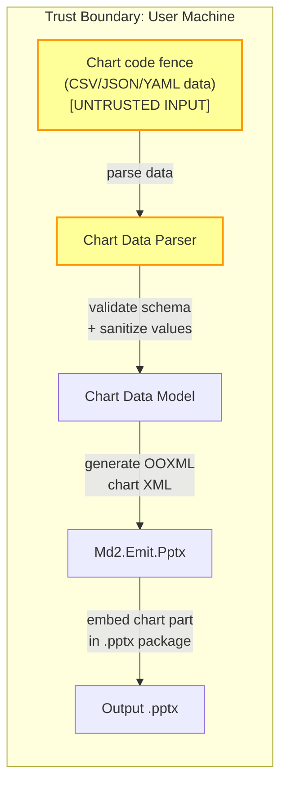

---
agent-notes:
  ctx: "STRIDE threat model, attack surface inventory"
  deps: [docs/architecture.md, docs/adrs/0010-irm-protected-templates.md, docs/adrs/0014-slide-document-ir.md, docs/adrs/0015-marp-parser-architecture.md, docs/adrs/0016-unified-theme-pptx-extension.md]
  state: active
  last: "pierrot@2026-03-15"
  key: ["Pierrot owns, Archie contributes DFDs", "local-only CLI, main threats are malicious input files", "YAML deser + path traversal + preview XSS are the real risks", "PPTX adds MARP directive YAML, template extraction, native shapes, chart XML surfaces"]
---
# Threat Model

<!-- Pierrot owns this document. Archie contributes data flow diagrams. -->
<!-- Created during Architecture phase. Updated when the attack surface changes. -->

**Project:** md2 -- Markdown to DOCX/PPTX converter CLI
**Last reviewed:** 2026-03-15
**Reviewed by:** Archie (DFDs), Pierrot (STRIDE analysis -- complete, PPTX surface added)

## System Overview

md2 is a local-only CLI tool that reads Markdown files from the local filesystem, applies styling via YAML themes and/or DOCX templates, and writes DOCX/PPTX output files. It optionally launches a Chromium process (via Playwright) for Mermaid diagram rendering and live preview. There is no network server, no authentication, no persistent state, and no cloud connectivity (air-gappable after initial Chromium download).

The PPTX pipeline accepts MARP-styled Markdown as input. MARP Markdown is standard Markdown with structural additions: YAML front matter with slide directives, `---` as slide separators, HTML comments as local/scoped directives (including custom `<!-- md2: {...} -->` extensions), and image syntax extensions. The tool also supports extracting themes from existing PPTX files, rendering Mermaid diagrams as native PPTX shapes (not just raster images), and generating native PPTX charts from code fence data.

**Users:** Technical professionals converting Markdown documentation to polished Office documents. Single-user, single-machine, interactive CLI use.

**Data handled:** Markdown source files (potentially containing sensitive/confidential content), DOCX/PPTX templates (potentially from enterprise environments with DRM), output documents, and rendered diagram images.

## Data Flow Diagrams

### DFD 1: Standard Conversion Flow

**Trust boundary notes:**
- All I/O is local filesystem. No network in this flow.
- `template.docx` is untrusted input: could be malformed XML, IRM-protected, macro-enabled, or adversarially crafted.
- Markdown files and images are semi-trusted (user's own files, but could contain path traversal in image references).
- Output file is written to a user-specified path.

### DFD 2: Mermaid Diagram Rendering

**Trust boundary notes:**
- Mermaid code blocks are untrusted input. They are rendered inside Chromium's sandbox, which limits the blast radius of malicious diagram definitions.
- Mermaid JS is bundled (not fetched from CDN at render time). Air-gappable after Chromium download.
- The Chromium download is the only network operation in the entire tool.
- The Chromium process runs sandboxed by Playwright's default security settings.

### DFD 3: Theme Extraction

**Trust boundary notes:**
- Template DOCX is the primary untrusted input surface. See ADR-0010 for IRM handling.
- IRM-protected files are detected by magic number check before Open XML SDK parsing.
- Macro-enabled files (.docm) are rejected by default.
- File size limit (50MB) prevents memory exhaustion from adversarially large templates.

### DFD 4: Preview Mode

**Trust boundary notes:**
- The HTTP server binds to localhost only (127.0.0.1) on a random port. Not accessible from the network.
- The WebSocket connection is also localhost-only.
- The rendered HTML contains the user's Markdown content. If the Markdown contains malicious HTML/JS (possible with raw HTML pass-through), it executes in the Chromium preview context. Mitigation: sanitize HTML output or disable raw HTML pass-through in preview mode.

### DFD 5: YAML Theme Parsing

**Trust boundary notes:**
- YAML deserialization must use YamlDotNet's safe loading mode (no arbitrary type instantiation). YAML deserialization vulnerabilities are a known attack vector.
- Variable interpolation (`${...}`) must have cycle detection and depth limits to prevent stack overflow.
- Schema validation rejects unexpected keys and values before they reach the pipeline.

### DFD 6: PPTX Conversion Flow (MARP Pipeline)

**Trust boundary notes:**
- MARP Markdown is untrusted input. It contains YAML payloads embedded in HTML comments (`<!-- class: invert -->`, `<!-- md2: {...} -->`). These are parsed by YamlDotNet and represent a YAML deserialization attack surface distinct from theme YAML and front matter YAML.
- `MarpDirectiveParser` and `MarpExtensionParser` are both highlighted as YAML deserialization points. The same safe deserialization controls as E-4 apply here.
- The `SlideDocument` IR is an in-memory data structure that is never persisted. It is the contract between the parser and the emitter.
- Per-slide transforms (syntax highlighting, math, Mermaid) operate on Markdig AST fragments within each slide. The same threats as the DOCX pipeline apply (D-2, D-5, T-4).
- The PPTX emitter writes Open XML `PresentationDocument` via the Open XML SDK, analogous to the DOCX emitter.
- `template.pptx` is untrusted input with the same threat profile as `template.docx` (malformed XML, macro-enabled, adversarially crafted).

### DFD 7: PPTX Template Extraction

**Trust boundary notes:**
- PPTX template extraction reads multiple XML parts from the PPTX package. Each part is a separate XML document parsed by the Open XML SDK.
- The extraction should read ONLY style-related parts (theme XML, slide master styles, layout defaults, presentation size). It must NOT read slide body content, speaker notes, embedded OLE objects, or VBA macros.
- `.pptm` (macro-enabled PPTX) should be rejected by default, consistent with `.docm` rejection for DOCX.
- The same 50MB file size limit should apply as for DOCX templates.
- PPTX files may contain embedded OLE objects, media files, or external hyperlinks. The extraction code must not follow external references or execute embedded content.

### DFD 8: Mermaid to Native PPTX Shapes

**Trust boundary notes:**
- Converting Mermaid diagrams to native PPTX shapes means the Mermaid input directly influences Open XML shape geometry, text runs, and connector definitions. There is no Chromium sandbox in this path -- the tool must parse and validate Mermaid structure itself.
- Crafted node labels, edge labels, or shape counts could inject malicious content into the PPTX XML or cause resource exhaustion.
- Complex or unsupported diagram types fall back to the Chromium rendering path (DFD 2), which has its own sandbox protections.

### DFD 9: Native PPTX Charts from Code Fence Data

**Trust boundary notes:**
- Chart code fences contain data in CSV, JSON, or YAML format. Each format has its own parsing and injection risks.
- The parsed data directly populates OOXML chart XML (`c:chartSpace`, `c:ser`, `c:val`). Malicious string values in labels or categories could inject XML fragments if not properly escaped.
- The chart data parser must validate data types (numbers are actually numbers, strings are bounded length) and enforce limits on series count and data point count to prevent resource exhaustion.

## Trust Boundaries

| Boundary | Description | Controls |
|----------|-------------|----------|
| Filesystem -> md2 process | All input files read from local fs | File header validation, size limits, IRM detection |
| md2 process -> Chromium | Mermaid diagram text injected into browser | Playwright sandbox, bundled JS (no CDN), page isolation |
| md2 process -> localhost HTTP | Preview server binding | Localhost-only binding, random port |
| Network -> local Chromium binary | One-time Chromium download | Playwright's built-in integrity verification |
| HTML comments -> YAML parser | MARP directives and md2 extensions parsed from HTML comments | Safe YamlDotNet deserialization, strongly-typed targets, schema validation |
| Mermaid text -> PPTX shapes | Diagram structure converted to Open XML shapes without Chromium sandbox | Input validation, node/edge count limits, label sanitization |
| Chart data -> PPTX chart XML | User-supplied data directly populates chart XML | Data type validation, string escaping, series/point count limits |
| PPTX template -> md2 process | Untrusted PPTX files read for theme extraction | File header validation, size limits, .pptm rejection, part-scoped reading |

## Assets

What are we protecting?

| Asset | Classification | Storage | Impact if compromised |
|-------|---------------|---------|----------------------|
| Markdown source files | Potentially confidential | Local filesystem | Information disclosure of sensitive document content |
| Output DOCX/PPTX files | Potentially confidential | Local filesystem | Information disclosure |
| DOCX templates | Potentially enterprise-sensitive | Local filesystem | Style/brand information leakage (low impact) |
| PPTX templates | Potentially enterprise-sensitive | Local filesystem | Style/brand information leakage; may contain speaker notes or slide content (medium impact) |
| YAML theme files | Low sensitivity | Local filesystem | Minimal impact |
| Rendered Mermaid PNGs (temp) | Potentially confidential (diagram content) | Temp directory | Information disclosure if temp files not cleaned |
| Speaker notes (in MARP Markdown) | Potentially confidential | Embedded in Markdown input, carried through SlideDocument to output PPTX | Information disclosure if notes leak into visible slide content or error messages |

## STRIDE Analysis

Completed by Pierrot, 2026-03-11. Updated 2026-03-15 for PPTX attack surface. Archie provided DFDs and initial threat identification.

**Severity calibration note:** md2 is a local-only, single-user CLI. There is no network attack surface in normal operation, no authentication, no multi-tenant concerns. Threats are calibrated accordingly -- most attacks require the user to voluntarily feed a malicious file to the tool, which limits realistic exploitation scenarios. The main concern is defense-in-depth against weaponized input files (e.g., a colleague sends you a "corporate template" that is actually booby-trapped).

### Spoofing (Identity)

| Component | Threat | Likelihood | Impact | Mitigation | Status |
|-----------|--------|------------|--------|------------|--------|
| N/A | No authentication in the tool | N/A | N/A | Local-only CLI, single-user. No identity to spoof. | Not applicable |

### Tampering (Data Integrity)

| ID | Component | Threat | Likelihood | Impact | Mitigation | Status |
|----|-----------|--------|------------|--------|------------|--------|
| T-1 | Template DOCX | Malformed XML in template causes incorrect/corrupted output | Medium | Medium | Validate template structure with Open XML SDK validation before use. Wrap all Open XML operations in structured error handling. If validation fails, abort with a clear error message -- never silently produce garbage output. | Mitigated |
| T-2 | YAML theme | Malicious YAML causes unexpected behavior via unsafe deserialization | Low | High | **MANDATORY:** Use `DeserializerBuilder` with `WithNodeTypeResolver` restricted to known types only. Do NOT use `Deserializer.Deserialize<object>()` or any configuration that enables arbitrary type instantiation. YamlDotNet versions before 5.0.0 had a critical deserialization vulnerability (CVE in Yamldotnet Project). Use version >= 13.0.0. Deserialize only into strongly-typed `ThemeDefinition` records. Schema-validate after parse. | Mitigated (requires implementation verification) |
| T-3 | YAML variable interpolation | Crafted `${...}` references cause infinite recursion or inject unexpected values | Low | Medium | Implement cycle detection (track visited variable references, abort on cycle). Enforce max interpolation depth of 10. Restrict interpolation targets to known theme property paths only -- do not allow arbitrary property resolution. | Mitigated (requires implementation verification) |
| T-4 | Mermaid input | Crafted diagram definition exploits Chromium rendering | Low | High | Mermaid code renders inside Chromium's sandbox. No persistent state between renders. Chromium process is torn down after use. Even if Mermaid JS is exploited, the blast radius is limited to the sandboxed browser context. | Accepted |
| T-5 | Output DOCX | Crafted input produces DOCX containing malicious XML (XXE in downstream consumers) | Very Low | Medium | Open XML SDK produces well-formed OOXML without external entity declarations. The SDK does not inject DTDs or external references. No action required beyond using the SDK as intended. .NET 4.5.2+ and all .NET Core/5+ versions set `XmlResolver = null` by default, preventing XXE. | Mitigated |
| T-6 | NuGet supply chain | Compromised NuGet package delivers malicious code | Very Low | Critical | Pin exact package versions in `.csproj` files. Enable NuGet package signature verification. Run `dotnet list package --vulnerable` in CI. Review SBOM at `docs/sbom/sbom.md` for known CVEs before each release. | Mitigated (requires CI setup) |
| T-7 | Chromium binary integrity | Tampered Chromium binary from Playwright download | Very Low | Critical | Playwright verifies download integrity via checksums. Note CVE-2025-59288 (signature verification flaw, CVSS 5.3 Medium) -- keep Playwright updated to latest patched version. Download only via official `playwright install chromium` command. | Mitigated |
| T-8 | MARP directive YAML injection | MARP directives in HTML comments (`<!-- class: invert -->`, `<!-- backgroundColor: #000 -->`) are parsed as YAML. A crafted directive could exploit YamlDotNet deserialization if parsed unsafely. | Low | High | **MANDATORY:** Apply the same safe deserialization controls as theme YAML (see E-4). The `MarpDirectiveParser` must deserialize HTML comment content into strongly-typed `SlideDirectives` records, never into `object` or `dynamic`. Reject unknown directive keys with a warning. MARP directives have a closed set of known keys (`class`, `backgroundColor`, `color`, `paginate`, `header`, `footer`, `_class`, `_backgroundColor`, etc.) -- validate against this allowlist after parsing. | Mitigated (requires implementation verification) |
| T-9 | md2 extension comment YAML injection | `<!-- md2: { build: "bullets", layout: "two-column" } -->` extension comments contain arbitrary YAML payloads. A crafted payload could exploit YamlDotNet deserialization or inject unexpected extension behavior. | Low | High | **MANDATORY:** The `MarpExtensionParser` must deserialize the YAML payload into a strongly-typed extension record (e.g., `Md2SlideExtension`), never into `object`, `dynamic`, or `Dictionary<string, object>`. Validate the payload against a schema of known extension keys (`build`, `layout`, `chart`). Reject unknown keys. Limit payload size (e.g., 10KB per comment) to prevent memory exhaustion from a single comment containing megabytes of YAML. | Mitigated (requires implementation verification) |
| T-10 | Template PPTX | Malformed XML in PPTX template causes incorrect/corrupted output or parser crash | Medium | Medium | Apply the same Open XML SDK validation as DOCX templates (T-1). Validate the `PresentationDocument` structure before extracting styles. Reject files that fail Open XML validation. Apply the same 50MB file size limit. Check for `.pptm` extension and reject macro-enabled presentations by default. | Mitigated (requires implementation verification) |
| T-11 | Mermaid native shape injection | When converting Mermaid diagrams to native PPTX shapes (bypassing Chromium sandbox), crafted node labels or edge labels could inject XML fragments into Open XML shape definitions if string values are interpolated into XML without escaping. | Medium | Medium | **MANDATORY:** All string values from Mermaid diagram content (node labels, edge labels, subgraph titles) must be XML-escaped before insertion into Open XML shape elements. Use the Open XML SDK's typed API (which handles escaping) rather than raw XML string construction. Never use string interpolation or concatenation to build Open XML elements. If raw XML construction is unavoidable (e.g., for custom shapes), use `SecurityElement.Escape()` or equivalent. | Mitigated (requires implementation verification) |
| T-12 | Chart data injection | Chart code fence data (CSV, JSON, YAML) directly populates OOXML chart XML. Malicious string values in category labels, series names, or data point labels could inject XML fragments into the chart part. | Medium | Medium | **MANDATORY:** All string values from chart data must be XML-escaped before insertion into chart XML elements. Use the Open XML SDK's typed API for chart construction. Validate that numeric values are actually valid numbers (reject `NaN`, `Infinity`, extremely large values). Enforce maximum string length for labels (e.g., 1000 characters). Enforce maximum series count (e.g., 50) and maximum data points per series (e.g., 10000) to prevent resource exhaustion in downstream PowerPoint. | Mitigated (requires implementation verification) |
| T-13 | Output PPTX | Crafted input produces PPTX containing malicious XML (XXE, embedded scripts, or external references in downstream consumers) | Very Low | Medium | Same mitigation as T-5. Open XML SDK produces well-formed OOXML. Additionally, ensure that no external hyperlinks, OLE objects, or media references from untrusted input are passed through to the output PPTX without validation. The output should contain only content derived from the user's Markdown and theme -- no pass-through of arbitrary URI schemes. | Mitigated |

### Repudiation (Accountability)

| Component | Threat | Likelihood | Impact | Mitigation | Status |
|-----------|--------|------------|--------|------------|--------|
| N/A | No audit trail needed | N/A | N/A | Local-only CLI, no multi-user scenarios. No accountability requirements. | Not applicable |

### Information Disclosure (Confidentiality)

| ID | Component | Threat | Likelihood | Impact | Mitigation | Status |
|----|-----------|--------|------------|--------|------------|--------|
| I-1 | Preview HTTP server | Sensitive document content served over HTTP on localhost | Low | Low | Bind to `127.0.0.1` only (not `0.0.0.0`). Use a random ephemeral port. The content is the user's own Markdown -- serving it to themselves over localhost is the intended behavior. Risk is that another local process could connect to the port. Acceptable for a dev tool. | Accepted |
| I-2 | Temp files (Mermaid PNGs) | Rendered diagram images persist in temp directory after tool exits | Low | Low | Register temp files for cleanup in a `finally` block or `IDisposable` pattern. Use `Path.GetTempFileName()` or equivalent with restrictive permissions. On abnormal exit (crash, SIGKILL), temp files may remain -- this is acceptable for a CLI tool; the OS temp cleaner handles it eventually. | Mitigated |
| I-3 | Error messages | Stack traces or internal file paths leak in error output | Low | Low | In release builds, show structured error messages without stack traces. Include file paths only when they are user-provided (input/output paths). Never include internal assembly paths, temp file paths, or system directory structures in user-facing errors. Use `--verbose` flag to expose diagnostic details only when explicitly requested. | Mitigated |
| I-4 | YAML theme variable interpolation | `${...}` references could be used to probe for property existence | Very Low | Very Low | Theme properties are not secrets. Interpolation only resolves within the theme file's own namespace. No filesystem, environment variable, or system property access via interpolation. | Accepted |
| I-5 | DOCX template content | Template extraction reads all parts of the DOCX, not just styles | Low | Low | `theme extract` should read only style-related parts (styles.xml, theme1.xml, fontTable.xml). Do not read or echo document body content, comments, tracked changes, or embedded objects. Log which parts were read at `--verbose` level. | Mitigated (requires implementation verification) |
| I-6 | PPTX template content leakage | PPTX template extraction reads multiple XML parts. Slide masters and layouts may contain text content, speaker notes, thumbnail images, or metadata beyond pure styling. | Low | Medium | `theme extract` for PPTX should read only: `ppt/theme/theme1.xml` (colors, fonts), style-related attributes from `ppt/slideMasters/*.xml` and `ppt/slideLayouts/*.xml` (backgrounds, font defaults), and `ppt/presentation.xml` (slide size). Do NOT read: slide body content (`ppt/slides/*.xml`), speaker notes (`ppt/notesSlides/*.xml`), thumbnail images (`docProps/thumbnail.jpeg`), comments, or embedded media. Do NOT echo any text content from slide masters beyond style property values. Log which parts were read at `--verbose` level. | Mitigated (requires implementation verification) |
| I-7 | Speaker notes in output PPTX | Speaker notes from MARP HTML comments are carried through the SlideDocument IR to the output PPTX. If error handling is poor, notes content could leak into error messages or visible slide content. | Very Low | Low | Speaker notes should only appear in the PPTX notes slide part (`ppt/notesSlides/*.xml`). They must never be rendered as visible slide content. Error messages referencing slide parsing failures should not include the raw HTML comment content (which may contain confidential speaker notes). | Mitigated |

### Denial of Service (Availability)

| ID | Component | Threat | Likelihood | Impact | Mitigation | Status |
|----|-----------|--------|------------|--------|------------|--------|
| D-1 | Large input files | Very large Markdown causes memory exhaustion | Low | Medium | CLI tool, single-user. Markdig streams the parse; memory use is proportional to AST size, not raw file size. OS limits apply. No artificial limit needed. | Accepted |
| D-2 | Mermaid rendering | Complex diagram causes Chromium hang or excessive resource use | Medium | Low | Enforce a per-diagram render timeout (30 seconds). If timeout fires, kill the Chromium page, emit a warning, and continue with remaining diagrams. Limit concurrent Chromium pages to prevent fork-bomb scenarios from documents with hundreds of diagrams. | Mitigated (requires implementation verification) |
| D-3 | YAML parsing | Deeply nested YAML causes stack overflow | Low | Low | YamlDotNet has a default recursion limit. Additionally, validate parsed `ThemeDefinition` depth -- themes have a flat/shallow structure by design, so reject any theme with nesting deeper than 5 levels. Variable interpolation cycle detection (see T-3) prevents infinite loops. | Mitigated |
| D-4 | Template extraction | Adversarially large DOCX template exhausts memory | Low | Low | File size limit of 50MB (per ADR-0010). Check file size before opening. Open XML SDK streams parts lazily, so even within the 50MB limit, memory use is bounded. | Mitigated |
| D-5 | Syntax highlighting | Extremely long code block or adversarial regex in grammar causes TextMateSharp hang | Very Low | Low | TextMateSharp uses oniguruma regex engine. Pathological input could cause regex backtracking. Mitigation: impose a per-code-block character limit (e.g., 1MB) and a per-block tokenization timeout (5 seconds). If exceeded, emit the code block as plain monospace text with a warning. | Mitigated (requires implementation verification) |
| D-6 | Preview file watcher | Rapid file changes trigger excessive re-renders | Low | Low | Debounce file change events (e.g., 300ms). Only one render in flight at a time; drop events that arrive while a render is in progress. | Mitigated (requires implementation verification) |
| D-7 | Mermaid native shape explosion | A crafted Mermaid diagram with thousands of nodes/edges is converted to native PPTX shapes, producing a massive slide with thousands of Open XML shape elements. PowerPoint may hang or crash when opening. The conversion itself may exhaust memory. | Medium | Medium | Enforce a maximum node count (e.g., 200 nodes) and edge count (e.g., 500 edges) for native shape conversion. If the diagram exceeds these limits, fall back to the Chromium rendering path (PNG image). Emit a warning explaining why the fallback was triggered. This protects both the conversion process and the downstream PowerPoint consumer. | Mitigated (requires implementation verification) |
| D-8 | Chart data volume | A chart code fence contains an extremely large dataset (millions of data points) that causes memory exhaustion during chart XML generation or makes the output PPTX unusable. | Low | Medium | Enforce maximum data points per chart (e.g., 10,000 total across all series). Enforce maximum series count (e.g., 50). If limits are exceeded, truncate with a warning or abort chart generation. These limits protect both md2 and the downstream PowerPoint consumer. | Mitigated (requires implementation verification) |
| D-9 | PPTX template extraction | Adversarially large PPTX template exhausts memory. PPTX files can be larger than DOCX because they may contain embedded media (images, video, audio). | Low | Low | Apply the same 50MB file size limit as DOCX templates. Check `FileInfo.Length` before opening. The extraction code reads only style-related parts (theme XML, slide master attributes, presentation XML), so even if the file contains large media parts, they are never loaded into memory. | Mitigated |
| D-10 | Excessive HTML comment directives | A MARP Markdown file contains thousands of HTML comment directives, each requiring YAML parsing. The cumulative parsing overhead causes slow conversion. | Very Low | Low | Not a realistic concern. YAML parsing of small directive snippets is fast. A presentation with thousands of directives would be pathological input. No artificial limit needed, but the per-comment size limit (T-9, 10KB) prevents individual comments from being expensive. | Accepted |
| D-11 | Slide count explosion | A Markdown file with thousands of `---` separators produces a SlideDocument with thousands of slides, causing memory exhaustion or an unusable output PPTX. | Very Low | Low | Enforce a maximum slide count (e.g., 500 slides). If exceeded, abort with a clear error message. A 500-slide presentation is already extreme for real-world use. This protects both md2 memory usage and downstream PowerPoint. | Mitigated (requires implementation verification) |

### Elevation of Privilege (Authorization)

| ID | Component | Threat | Likelihood | Impact | Mitigation | Status |
|----|-----------|--------|------------|--------|------------|--------|
| E-1 | Chromium process | Browser sandbox escape via crafted Mermaid diagram | Very Low | High | Playwright maintains Chromium at a pinned version with security patches. The Mermaid rendering page has no access to Node.js APIs, filesystem, or network. The sandbox is Chromium's standard multi-process sandbox. Keep Playwright updated. Note: CVE-2025-59288 affects Playwright's download integrity verification (not the sandbox itself). | Accepted |
| E-2 | Path traversal (images) | Image references like `` or `` read arbitrary files | Low | Medium | **MANDATORY:** Resolve all image paths relative to the input Markdown file's directory. Reject any resolved path that is not a descendant of the input file's directory (or a set of explicitly allowed asset directories). Reject absolute paths. Reject paths containing `..` segments after normalization. Use `Path.GetFullPath()` and then verify the canonical path starts with the allowed base directory. | Mitigated (requires implementation verification) |
| E-3 | Path traversal (output) | User specifies output path that overwrites sensitive files | Very Low | Medium | The output path is explicitly provided by the user via `-o` flag -- this is intentional behavior, not a vulnerability. The user has filesystem permissions to the path they specify. However: never default to overwriting an existing file without `--force` or a confirmation prompt. | Mitigated |
| E-4 | YAML deserialization to code execution | YamlDotNet unsafe deserialization instantiates arbitrary .NET types | Very Low | Critical | **MANDATORY:** This is the single most important security control in the entire tool. Use `new DeserializerBuilder().Build()` which defaults to safe mode in YamlDotNet >= 5.0.0. Never use `new Deserializer()` (the legacy constructor). Never configure `WithTagMapping` for untrusted types. Never call `Deserialize<object>()`. Always deserialize into specific, known record types (`ThemeDefinition`, `FrontMatter`). Validate the YamlDotNet version is >= 13.0.0 in the SBOM. | Mitigated (requires implementation verification) |
| E-5 | Preview mode XSS | Raw HTML in Markdown executes arbitrary JavaScript in the Chromium preview window | Low | Low | The preview Chromium instance is a local, throwaway browser window with no access to user sessions, cookies, or sensitive data. Even if JS executes, the blast radius is limited to that isolated preview tab. However, for defense-in-depth: (a) use Markdig's `.DisableHtml()` extension in preview mode to encode raw HTML as text, or (b) set a strict Content-Security-Policy header on the preview server (`default-src 'self'; script-src 'none'`). Option (b) is preferred because it preserves the user's HTML rendering while blocking script execution. | Mitigated (requires implementation verification) |
| E-6 | MARP directive YAML deserialization to code execution | MARP directives in HTML comments are a new YAML deserialization surface. Unlike theme YAML (a separate file the user explicitly provides), directives are embedded inline in the Markdown document body. A user might receive a MARP Markdown file from an external source and not realize it contains YAML payloads in comments. This is a more plausible attack vector than theme YAML because Markdown files are more commonly shared than theme files. | Low | Critical | **MANDATORY:** Apply the same safe deserialization controls as E-4 to all three YAML parsing entry points in the PPTX pipeline: (1) `MarpDirectiveParser` for MARP standard directives, (2) `MarpExtensionParser` for `<!-- md2: {...} -->` payloads, and (3) YAML front matter with MARP-specific fields (`theme`, `paginate`, `size`, `headingDivider`). All three must deserialize into strongly-typed records. All three must use `DeserializerBuilder` in safe mode. All three must reject unknown YAML tags. Code review must verify all three independently -- a single safe call site does not guarantee all call sites are safe. | Mitigated (requires implementation verification) |
| E-7 | PPTX template embedded objects | A crafted PPTX template contains embedded OLE objects, ActiveX controls, or VBA macros that could be passed through to the output or trigger execution during parsing. | Very Low | High | The Open XML SDK does not execute embedded content. However, ensure that the PPTX template extraction and template-based emission paths do not blindly copy all parts from the template to the output. Only copy style-related parts (theme, slide masters, layouts). Reject `.pptm` files (macro-enabled) by extension check. If embedded OLE parts are encountered during extraction, log a warning and skip them. | Mitigated (requires implementation verification) |
| E-8 | Background image path traversal (MARP) | MARP directives allow specifying background images via `<!-- backgroundColor: url(../../../etc/passwd) -->` or `backgroundImage` directives. If the path is resolved without the same traversal checks as inline images (E-2), it becomes a path traversal vector. | Low | Medium | **MANDATORY:** Apply the same path traversal prevention as E-2 to all image paths specified via MARP directives (`backgroundImage`, `bg` image syntax). The `SlideDirectives.BackgroundImage` value must be resolved and validated using the same base-directory check before any filesystem read. | Mitigated (requires implementation verification) |

## Additional Threats Not in Original STRIDE (Added by Pierrot)

These threats were not in Archie's initial analysis. Adding them for completeness.

### DOCX XML Bomb (Billion Laughs)

| ID | Component | Threat | Likelihood | Impact | Mitigation | Status |
|----|-----------|--------|------------|--------|------------|--------|
| X-1 | Template DOCX | A crafted DOCX template contains XML with recursive entity expansion (billion laughs attack) that causes memory exhaustion when parsed | Very Low | Medium | .NET's XML parser (used internally by Open XML SDK) has DTD processing disabled by default in .NET Core/5+. The `XmlReaderSettings.DtdProcessing` defaults to `Prohibit`. The Open XML SDK does not enable DTD processing. Additionally, the 50MB file size limit caps the decompressed XML size. No additional action required. | Mitigated |

### Front Matter YAML Injection

| ID | Component | Threat | Likelihood | Impact | Mitigation | Status |
|----|-----------|--------|------------|--------|------------|--------|
| X-2 | YAML front matter in Markdown | Front matter YAML in Markdown files is parsed by YamlDotNet and could trigger the same deserialization vulnerabilities as theme YAML | Very Low | High | Apply the same safe deserialization controls as theme YAML (see E-4). Deserialize front matter into a strongly-typed `FrontMatter` record, never into `object` or `dynamic`. Front matter fields should be a closed set (title, author, date, etc.) -- reject unknown fields with a warning. | Mitigated (requires implementation verification) |

### Temp File Race Condition

| ID | Component | Threat | Likelihood | Impact | Mitigation | Status |
|----|-----------|--------|------------|--------|------------|--------|
| X-3 | Mermaid temp files | TOCTOU race between writing a temp PNG and embedding it into the DOCX, where another process swaps the file | Very Low | Low | Use uniquely-named temp files (GUID-based). For extra hardening, keep temp files open (file handle held) between write and read. This is a theoretical concern for a single-user CLI tool -- accepted as low risk. | Accepted |

### Output File Symlink Attack

| ID | Component | Threat | Likelihood | Impact | Mitigation | Status |
|----|-----------|--------|------------|--------|------------|--------|
| X-4 | Output file path | The output path is a symlink to a sensitive file, causing md2 to overwrite it | Very Low | Medium | This is a standard Unix symlink attack. For a single-user CLI tool, the user is attacking themselves. No special mitigation needed beyond the `--force` overwrite protection (see E-3). Users who create symlinks at their own output paths get what they asked for. | Accepted |

### PPTX XML Bomb (Billion Laughs)

| ID | Component | Threat | Likelihood | Impact | Mitigation | Status |
|----|-----------|--------|------------|--------|------------|--------|
| X-5 | Template PPTX | A crafted PPTX template contains XML with recursive entity expansion in any of its XML parts (theme, slide masters, layouts, presentation). Same attack as X-1 but via PPTX container. | Very Low | Medium | Same mitigation as X-1. .NET's XML parser has DTD processing disabled by default. The Open XML SDK does not enable DTD processing. The 50MB file size limit caps decompressed XML size. No additional action required beyond what is already in place for DOCX. | Mitigated |

### Mermaid Label XSS in Native Shapes

| ID | Component | Threat | Likelihood | Impact | Mitigation | Status |
|----|-----------|--------|------------|--------|------------|--------|
| X-6 | Mermaid native PPTX shapes | Mermaid node labels can contain HTML-like syntax (Mermaid supports basic HTML in labels). When converting to native PPTX shapes, these labels are placed into Open XML text runs. If the conversion naively preserves HTML tags from labels, the resulting PPTX could contain unexpected formatting or, in extreme cases, malformed XML. | Low | Low | Strip or escape HTML tags from Mermaid node/edge labels before inserting into Open XML text runs. Mermaid's HTML label support is for Mermaid's own rendering -- it has no meaning in PPTX. Use plain text extraction only. The Open XML SDK's `Text` element auto-escapes XML special characters, so the primary risk is malformed rendering, not XML injection, when using the typed API. | Mitigated (requires implementation verification) |

### Chart Formula Injection

| ID | Component | Threat | Likelihood | Impact | Mitigation | Status |
|----|-----------|--------|------------|--------|------------|--------|
| X-7 | Native PPTX charts | Chart category labels or series names could contain formula-injection payloads (e.g., `=EXEC(...)`, `=cmd\|'...'`). While PPTX charts do not execute formulas like Excel, if a user copies chart data to Excel, formula injection could trigger. This is a defense-in-depth concern. | Very Low | Low | Prefix string values that start with `=`, `+`, `-`, `@`, or `\t` with a single quote (`'`) to neutralize formula injection when chart data is copied to spreadsheet applications. This is a standard CSV injection defense applied to chart label strings. Document this behavior so users understand why leading characters may appear quoted. | Mitigated (requires implementation verification) |

### MARP External Image References

| ID | Component | Threat | Likelihood | Impact | Mitigation | Status |
|----|-----------|--------|------------|--------|------------|--------|
| X-8 | MARP background images | MARP directives and image syntax support URLs (``). If the tool fetches external URLs during conversion, it creates a network exfiltration vector (the fetch leaks the user's IP, timing, and the fact that they are converting this specific document). | Low | Medium | Do NOT fetch external URLs during conversion. The tool is designed to be air-gappable. Image references must be local filesystem paths. If a URL is encountered in an image reference or background directive, emit a warning and skip the image (do not embed a broken reference, do not fetch the URL). Document this limitation clearly. | Mitigated (requires implementation verification) |

## Attack Surface Inventory

| Surface | Protocol | Auth required? | Exposed to | Notes |
|---------|----------|---------------|------------|-------|
| CLI arguments | Process args | No (local user) | Local user only | Standard CLI trust model |
| Markdown input files | Filesystem read | No | Local files | Semi-trusted (user's own files) |
| YAML front matter | Embedded in Markdown, parsed by YamlDotNet | No | Local files | Same trust level as theme YAML |
| MARP directives in HTML comments | Embedded in Markdown, parsed as YAML by MarpDirectiveParser | No | Local files | **New PPTX surface.** YAML payloads in HTML comments. More likely to arrive from external sources than standalone theme files. Same deserialization risk as theme YAML. |
| md2 extension comments | Embedded in Markdown, parsed as YAML by MarpExtensionParser | No | Local files | **New PPTX surface.** `<!-- md2: {...} -->` syntax. Contains chart config, layout hints, build animations. YAML deserialization risk. |
| DOCX template files | Filesystem read (Open XML) | No | Local files | Untrusted (may come from external sources) |
| PPTX template files | Filesystem read (Open XML) | No | Local files | **New PPTX surface.** Untrusted. Same risk profile as DOCX templates plus embedded media, OLE objects, and richer XML part structure. |
| YAML theme files | Filesystem read (YamlDotNet) | No | Local files | Untrusted (may come from external sources). Now includes `pptx:` section with chart palettes, slide sizes, layout properties. |
| Image file references | Filesystem read (referenced from Markdown) | No | Local files | Path traversal risk -- must be constrained |
| MARP background image references | Referenced in HTML comment directives, resolved against filesystem | No | Local files | **New PPTX surface.** Path traversal risk. Must apply same constraints as inline image references (E-2). External URLs must be rejected. |
| Mermaid code blocks (Chromium path) | Embedded in Markdown, rendered in Chromium | No | Chromium sandbox | Untrusted, but sandboxed |
| Mermaid code blocks (native shape path) | Embedded in Markdown, converted to PPTX shapes without Chromium | No | md2 process directly | **New PPTX surface.** No sandbox. Node labels, edge labels, and shape geometry are directly translated to Open XML elements. Input validation is the only defense. |
| Chart code fences | Embedded in Markdown, data parsed as CSV/JSON/YAML | No | md2 process directly | **New PPTX surface.** Data directly populates OOXML chart XML. Multiple parsing formats (CSV, JSON, YAML) each with their own injection risks. |
| Preview HTTP server | HTTP, localhost only | No | localhost | Random port, no external binding |
| Preview WebSocket | WS, localhost only | No | localhost | Hot-reload channel |
| Chromium subprocess | IPC (Playwright protocol) | No | md2 process only | Sandboxed |

## ADR-0010 Validation (IRM-Protected Templates)

Reviewed by Pierrot, 2026-03-11.

**Verdict: Approved.** The fail-fast approach is the correct security decision.

**Strengths:**
- Early detection via magic number check avoids exposing the Open XML SDK parser to adversarial OLE compound documents.
- No credential handling, no RMS integration, no expanded attack surface.
- Clear error messaging with actionable remediation steps.
- Distinct exit codes enable scripted workflows.
- `.docm` (macro-enabled) rejection is a good defense-in-depth control.

**One addition recommended:** The magic number check should also handle the case where the first 4 bytes are neither ZIP nor OLE -- this is already covered in the ADR ("Neither: Not a valid DOCX. Report error."). Good.

**One concern (low):** The 50MB file size limit is checked, but ensure this check happens BEFORE any file parsing (i.e., check `FileInfo.Length` before reading any bytes). A malicious file could claim to be small via filesystem metadata manipulation on some exotic filesystems, but this is not a realistic threat for local CLI use.

## Open Risks

Risks that are accepted and tracked for periodic review.

| ID | Risk | Severity | Likelihood | Rationale for acceptance | Review date |
|----|------|----------|------------|------------------------|-------------|
| E-1 | Chromium sandbox escape via crafted Mermaid | High | Very Low | Playwright/Chromium sandbox is industry-standard. The Mermaid rendering context has no filesystem or network access. If Chromium's sandbox is broken, every Electron app and browser on the planet has the same problem. We are not a more attractive target than those. | 2026-09-11 |
| D-1 | Memory exhaustion from very large Markdown files | Medium | Low | CLI tool, single-user. OS memory limits are sufficient. Users processing 100MB Markdown files know what they are doing. | 2026-09-11 |
| I-1 | Sensitive content on localhost preview server | Low | Low | Content is the user's own Markdown. localhost-only binding. Another local process could theoretically connect, but this requires a separate local compromise first. Acceptable for a dev tool. | 2026-09-11 |
| X-3 | Temp file race condition (Mermaid PNGs) | Low | Very Low | Single-user CLI. Theoretical TOCTOU window. Not worth the complexity of mitigation. | 2026-09-11 |
| X-4 | Output symlink attack | Medium | Very Low | User attacking themselves. Standard Unix CLI trust model. | 2026-09-11 |
| T-4 | Mermaid JS exploitation within sandbox | High | Very Low | Even if Mermaid JS has a vulnerability, it is contained within Chromium's sandbox with no filesystem/network access. | 2026-09-11 |
| D-10 | Excessive MARP directive parsing overhead | Low | Very Low | YAML parsing of small directive snippets is fast. Pathological input only. | 2026-09-15 |

## Implementation Verification Checklist

The following items are marked "Mitigated (requires implementation verification)" above. During code review, Pierrot must verify each one:

### Existing (DOCX pipeline)

- [ ] **E-4 / X-2: YamlDotNet safe deserialization** -- Confirm `DeserializerBuilder` is used (not legacy `Deserializer`). Confirm deserialization targets are strongly-typed records. Confirm no `WithTagMapping` for untrusted types. Confirm YamlDotNet >= 13.0.0.
- [ ] **T-2: YAML theme schema validation** -- Confirm parsed themes are validated against a schema before use.
- [ ] **T-3: Variable interpolation safety** -- Confirm cycle detection and max depth (10) are implemented.
- [ ] **E-2: Image path traversal prevention** -- Confirm `Path.GetFullPath()` + base directory check is implemented. Confirm `..` and absolute paths are rejected.
- [ ] **E-5: Preview CSP header** -- Confirm `Content-Security-Policy: default-src 'self'; script-src 'none'` is set on preview HTTP responses.
- [ ] **D-2: Mermaid render timeout** -- Confirm 30-second per-diagram timeout is enforced.
- [ ] **D-5: Syntax highlighting timeout** -- Confirm per-block size limit and tokenization timeout.
- [ ] **D-6: File watcher debounce** -- Confirm debouncing is implemented for preview mode.
- [ ] **I-2: Temp file cleanup** -- Confirm temp files are registered for cleanup in `finally`/`IDisposable`.
- [ ] **I-5: Template extraction scope** -- Confirm only style-related DOCX parts are read.
- [ ] **T-6: NuGet vulnerability scanning in CI** -- Confirm `dotnet list package --vulnerable` runs in CI pipeline.

### New (PPTX pipeline)

- [ ] **T-8: MARP directive safe deserialization** -- Confirm `MarpDirectiveParser` uses `DeserializerBuilder` in safe mode. Confirm deserialization target is strongly-typed `SlideDirectives` (not `object`). Confirm unknown directive keys are rejected or warned.
- [ ] **T-9: md2 extension comment safe deserialization** -- Confirm `MarpExtensionParser` uses `DeserializerBuilder` in safe mode. Confirm deserialization target is strongly-typed. Confirm per-comment size limit (10KB). Confirm unknown extension keys are rejected.
- [ ] **E-6: All three MARP YAML entry points safe** -- Independently verify safe deserialization in: (1) `MarpDirectiveParser`, (2) `MarpExtensionParser`, (3) front matter with MARP fields. All three must be checked -- do not assume one correct call site means all are correct.
- [ ] **T-10: PPTX template validation** -- Confirm Open XML SDK validation is applied to PPTX templates. Confirm `.pptm` files are rejected by extension. Confirm 50MB file size limit is enforced.
- [ ] **T-11: Mermaid shape XML escaping** -- Confirm all Mermaid node/edge labels are XML-escaped or inserted via Open XML SDK typed API. Confirm no raw XML string construction with user-controlled values.
- [ ] **T-12: Chart data XML escaping** -- Confirm all chart label strings are XML-escaped or inserted via Open XML SDK typed API. Confirm numeric validation (reject NaN, Infinity). Confirm maximum string length, series count, and data point limits.
- [ ] **D-7: Mermaid native shape count limits** -- Confirm maximum node count (200) and edge count (500) for native shape conversion. Confirm fallback to Chromium rendering when limits exceeded.
- [ ] **D-8: Chart data volume limits** -- Confirm maximum data points (10,000) and series count (50). Confirm graceful handling when limits exceeded.
- [ ] **D-11: Slide count limit** -- Confirm maximum slide count (500) is enforced.
- [ ] **I-6: PPTX template extraction scope** -- Confirm only style-related PPTX parts are read (theme XML, slide master style attributes, layout style attributes, presentation size). Confirm slide body content, speaker notes, thumbnails, and embedded media are NOT read.
- [ ] **E-7: PPTX template part filtering** -- Confirm that template-based emission does not blindly copy all parts from the template PPTX. Confirm OLE objects, ActiveX controls, and VBA macros are not passed through.
- [ ] **E-8: Background image path traversal** -- Confirm `SlideDirectives.BackgroundImage` paths are validated using the same base-directory check as E-2. Confirm external URLs are rejected.
- [ ] **X-6: Mermaid HTML label stripping** -- Confirm HTML tags are stripped from Mermaid labels before insertion into PPTX text runs.
- [ ] **X-7: Chart formula injection defense** -- Confirm string values starting with `=`, `+`, `-`, `@`, `\t` are prefixed with `'` in chart labels.
- [ ] **X-8: External URL rejection** -- Confirm image references and background directives with HTTP/HTTPS URLs are skipped with a warning. Confirm no network fetch occurs during conversion.

## Supply Chain Notes

See `docs/sbom/sbom.md` for the full SBOM and `docs/sbom/dependency-decisions.md` for dependency rationale.

Key supply chain observations:
- **All direct dependencies use permissive licenses** (MIT, BSD-2-Clause, Apache-2.0). No copyleft concerns.
- **CVE-2025-59288** (Playwright signature verification, Medium) -- Keep Playwright pinned to latest patched version.
- **YamlDotNet deserialization history** -- Versions < 5.0.0 had critical unsafe deserialization. We require >= 13.0.0. **The PPTX pipeline adds two new YamlDotNet call sites** (MarpDirectiveParser, MarpExtensionParser) beyond the existing theme/front-matter call sites. Each must be independently verified for safe deserialization.
- **TextMateSharp** -- Single maintainer (danipen). MIT license. No known CVEs. Monitor for abandonment (bus factor = 1).
- **Markdig** -- Single maintainer (xoofx). BSD-2-Clause. No known CVEs. Widely used (.NET ecosystem standard). Bus factor concern mitigated by large user base.
- **Open XML SDK** -- Microsoft-maintained. MIT license. No known CVEs in current versions. Strong organizational backing. **The PPTX pipeline exercises the PresentationDocument API** (in addition to the existing WordprocessingDocument API). Both APIs share the same XML handling infrastructure, so the same DTD/XXE protections apply.
- **System.CommandLine** -- Microsoft-maintained. MIT license. Long beta period but now stable (2.0.3). Strong organizational backing.
