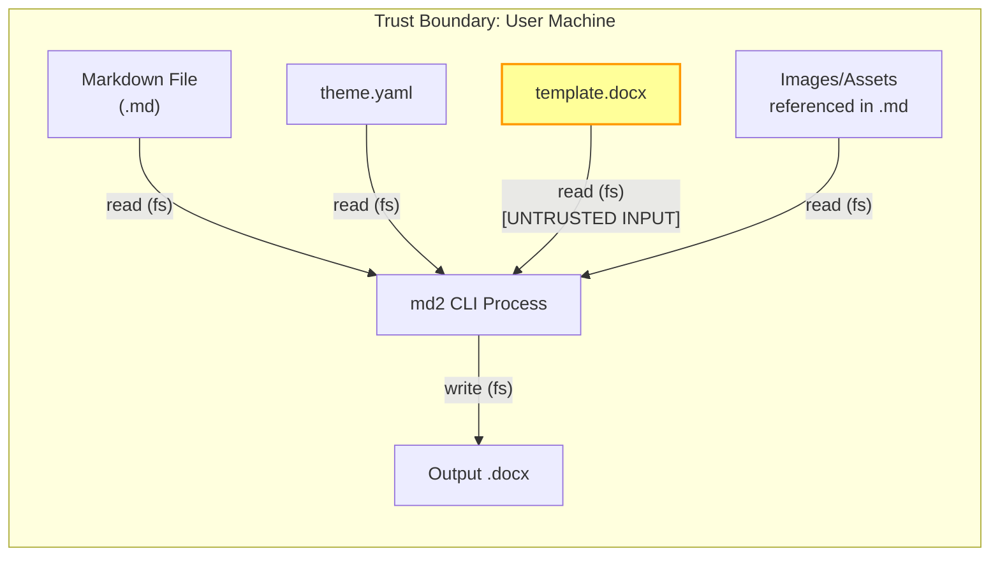
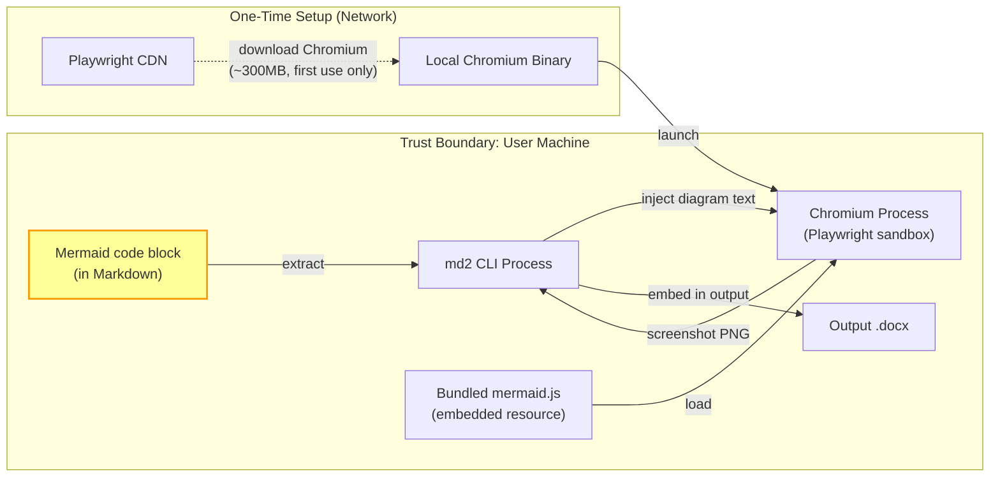
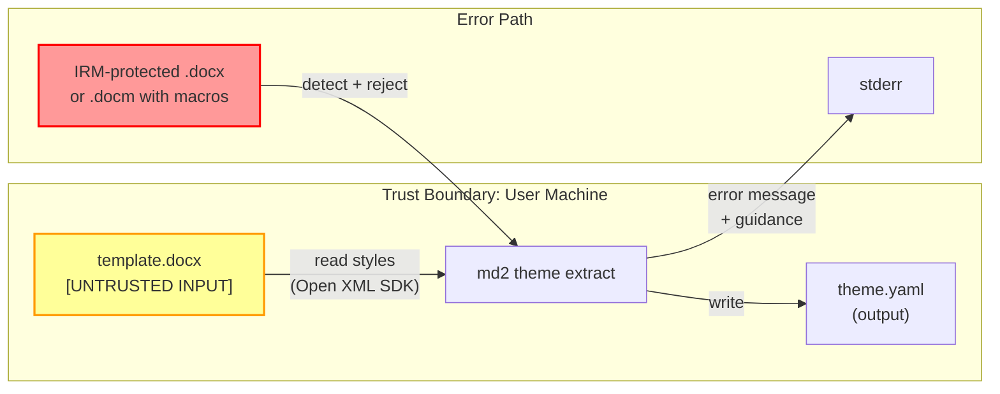
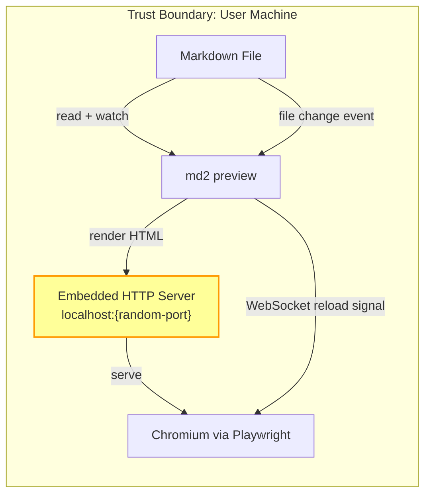
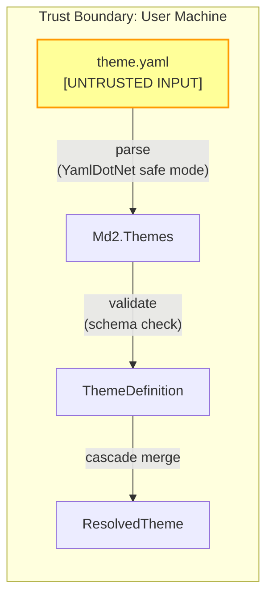

---
agent-notes:
  ctx: "STRIDE threat model, attack surface inventory"
  deps: [docs/architecture.md, docs/adrs/0010-irm-protected-templates.md]
  state: active
  last: "pierrot@2026-03-11"
  key: ["Pierrot owns, Archie contributes DFDs", "local-only CLI, main threats are malicious input files", "YAML deser + path traversal + preview XSS are the real risks"]
---
# Threat Model

<!-- Pierrot owns this document. Archie contributes data flow diagrams. -->
<!-- Created during Architecture phase. Updated when the attack surface changes. -->

**Project:** md2 -- Markdown to DOCX/PPTX converter CLI
**Last reviewed:** 2026-03-11
**Reviewed by:** Archie (DFDs), Pierrot (STRIDE analysis -- complete)

## System Overview

md2 is a local-only CLI tool that reads Markdown files from the local filesystem, applies styling via YAML themes and/or DOCX templates, and writes DOCX/PPTX output files. It optionally launches a Chromium process (via Playwright) for Mermaid diagram rendering and live preview. There is no network server, no authentication, no persistent state, and no cloud connectivity (air-gappable after initial Chromium download).

**Users:** Technical professionals converting Markdown documentation to polished Office documents. Single-user, single-machine, interactive CLI use.

**Data handled:** Markdown source files (potentially containing sensitive/confidential content), DOCX templates (potentially from enterprise environments with DRM), output documents, and rendered diagram images.

## Data Flow Diagrams

### DFD 1: Standard Conversion Flow

**Trust boundary notes:**
- All I/O is local filesystem. No network in this flow.
- `template.docx` is untrusted input: could be malformed XML, IRM-protected, macro-enabled, or adversarially crafted.
- Markdown files and images are semi-trusted (user's own files, but could contain path traversal in image references).
- Output file is written to a user-specified path.

### DFD 2: Mermaid Diagram Rendering

**Trust boundary notes:**
- Mermaid code blocks are untrusted input. They are rendered inside Chromium's sandbox, which limits the blast radius of malicious diagram definitions.
- Mermaid JS is bundled (not fetched from CDN at render time). Air-gappable after Chromium download.
- The Chromium download is the only network operation in the entire tool.
- The Chromium process runs sandboxed by Playwright's default security settings.

### DFD 3: Theme Extraction

**Trust boundary notes:**
- Template DOCX is the primary untrusted input surface. See ADR-0010 for IRM handling.
- IRM-protected files are detected by magic number check before Open XML SDK parsing.
- Macro-enabled files (.docm) are rejected by default.
- File size limit (50MB) prevents memory exhaustion from adversarially large templates.

### DFD 4: Preview Mode

**Trust boundary notes:**
- The HTTP server binds to localhost only (127.0.0.1) on a random port. Not accessible from the network.
- The WebSocket connection is also localhost-only.
- The rendered HTML contains the user's Markdown content. If the Markdown contains malicious HTML/JS (possible with raw HTML pass-through), it executes in the Chromium preview context. Mitigation: sanitize HTML output or disable raw HTML pass-through in preview mode.

### DFD 5: YAML Theme Parsing

**Trust boundary notes:**
- YAML deserialization must use YamlDotNet's safe loading mode (no arbitrary type instantiation). YAML deserialization vulnerabilities are a known attack vector.
- Variable interpolation (`${...}`) must have cycle detection and depth limits to prevent stack overflow.
- Schema validation rejects unexpected keys and values before they reach the pipeline.

## Trust Boundaries

| Boundary | Description | Controls |
|----------|-------------|----------|
| Filesystem -> md2 process | All input files read from local fs | File header validation, size limits, IRM detection |
| md2 process -> Chromium | Mermaid diagram text injected into browser | Playwright sandbox, bundled JS (no CDN), page isolation |
| md2 process -> localhost HTTP | Preview server binding | Localhost-only binding, random port |
| Network -> local Chromium binary | One-time Chromium download | Playwright's built-in integrity verification |

## Assets

What are we protecting?

| Asset | Classification | Storage | Impact if compromised |
|-------|---------------|---------|----------------------|
| Markdown source files | Potentially confidential | Local filesystem | Information disclosure of sensitive document content |
| Output DOCX/PPTX files | Potentially confidential | Local filesystem | Information disclosure |
| DOCX templates | Potentially enterprise-sensitive | Local filesystem | Style/brand information leakage (low impact) |
| YAML theme files | Low sensitivity | Local filesystem | Minimal impact |
| Rendered Mermaid PNGs (temp) | Potentially confidential (diagram content) | Temp directory | Information disclosure if temp files not cleaned |

## STRIDE Analysis

Completed by Pierrot, 2026-03-11. Archie provided DFDs and initial threat identification.

**Severity calibration note:** md2 is a local-only, single-user CLI. There is no network attack surface in normal operation, no authentication, no multi-tenant concerns. Threats are calibrated accordingly -- most attacks require the user to voluntarily feed a malicious file to the tool, which limits realistic exploitation scenarios. The main concern is defense-in-depth against weaponized input files (e.g., a colleague sends you a "corporate template" that is actually booby-trapped).

### Spoofing (Identity)

| Component | Threat | Likelihood | Impact | Mitigation | Status |
|-----------|--------|------------|--------|------------|--------|
| N/A | No authentication in the tool | N/A | N/A | Local-only CLI, single-user. No identity to spoof. | Not applicable |

### Tampering (Data Integrity)

| ID | Component | Threat | Likelihood | Impact | Mitigation | Status |
|----|-----------|--------|------------|--------|------------|--------|
| T-1 | Template DOCX | Malformed XML in template causes incorrect/corrupted output | Medium | Medium | Validate template structure with Open XML SDK validation before use. Wrap all Open XML operations in structured error handling. If validation fails, abort with a clear error message -- never silently produce garbage output. | Mitigated |
| T-2 | YAML theme | Malicious YAML causes unexpected behavior via unsafe deserialization | Low | High | **MANDATORY:** Use `DeserializerBuilder` with `WithNodeTypeResolver` restricted to known types only. Do NOT use `Deserializer.Deserialize<object>()` or any configuration that enables arbitrary type instantiation. YamlDotNet versions before 5.0.0 had a critical deserialization vulnerability (CVE in Yamldotnet Project). Use version >= 13.0.0. Deserialize only into strongly-typed `ThemeDefinition` records. Schema-validate after parse. | Mitigated (requires implementation verification) |
| T-3 | YAML variable interpolation | Crafted `${...}` references cause infinite recursion or inject unexpected values | Low | Medium | Implement cycle detection (track visited variable references, abort on cycle). Enforce max interpolation depth of 10. Restrict interpolation targets to known theme property paths only -- do not allow arbitrary property resolution. | Mitigated (requires implementation verification) |
| T-4 | Mermaid input | Crafted diagram definition exploits Chromium rendering | Low | High | Mermaid code renders inside Chromium's sandbox. No persistent state between renders. Chromium process is torn down after use. Even if Mermaid JS is exploited, the blast radius is limited to the sandboxed browser context. | Accepted |
| T-5 | Output DOCX | Crafted input produces DOCX containing malicious XML (XXE in downstream consumers) | Very Low | Medium | Open XML SDK produces well-formed OOXML without external entity declarations. The SDK does not inject DTDs or external references. No action required beyond using the SDK as intended. .NET 4.5.2+ and all .NET Core/5+ versions set `XmlResolver = null` by default, preventing XXE. | Mitigated |
| T-6 | NuGet supply chain | Compromised NuGet package delivers malicious code | Very Low | Critical | Pin exact package versions in `.csproj` files. Enable NuGet package signature verification. Run `dotnet list package --vulnerable` in CI. Review SBOM at `docs/sbom/sbom.md` for known CVEs before each release. | Mitigated (requires CI setup) |
| T-7 | Chromium binary integrity | Tampered Chromium binary from Playwright download | Very Low | Critical | Playwright verifies download integrity via checksums. Note CVE-2025-59288 (signature verification flaw, CVSS 5.3 Medium) -- keep Playwright updated to latest patched version. Download only via official `playwright install chromium` command. | Mitigated |

### Repudiation (Accountability)

| Component | Threat | Likelihood | Impact | Mitigation | Status |
|-----------|--------|------------|--------|------------|--------|
| N/A | No audit trail needed | N/A | N/A | Local-only CLI, no multi-user scenarios. No accountability requirements. | Not applicable |

### Information Disclosure (Confidentiality)

| ID | Component | Threat | Likelihood | Impact | Mitigation | Status |
|----|-----------|--------|------------|--------|------------|--------|
| I-1 | Preview HTTP server | Sensitive document content served over HTTP on localhost | Low | Low | Bind to `127.0.0.1` only (not `0.0.0.0`). Use a random ephemeral port. The content is the user's own Markdown -- serving it to themselves over localhost is the intended behavior. Risk is that another local process could connect to the port. Acceptable for a dev tool. | Accepted |
| I-2 | Temp files (Mermaid PNGs) | Rendered diagram images persist in temp directory after tool exits | Low | Low | Register temp files for cleanup in a `finally` block or `IDisposable` pattern. Use `Path.GetTempFileName()` or equivalent with restrictive permissions. On abnormal exit (crash, SIGKILL), temp files may remain -- this is acceptable for a CLI tool; the OS temp cleaner handles it eventually. | Mitigated |
| I-3 | Error messages | Stack traces or internal file paths leak in error output | Low | Low | In release builds, show structured error messages without stack traces. Include file paths only when they are user-provided (input/output paths). Never include internal assembly paths, temp file paths, or system directory structures in user-facing errors. Use `--verbose` flag to expose diagnostic details only when explicitly requested. | Mitigated |
| I-4 | YAML theme variable interpolation | `${...}` references could be used to probe for property existence | Very Low | Very Low | Theme properties are not secrets. Interpolation only resolves within the theme file's own namespace. No filesystem, environment variable, or system property access via interpolation. | Accepted |
| I-5 | DOCX template content | Template extraction reads all parts of the DOCX, not just styles | Low | Low | `theme extract` should read only style-related parts (styles.xml, theme1.xml, fontTable.xml). Do not read or echo document body content, comments, tracked changes, or embedded objects. Log which parts were read at `--verbose` level. | Mitigated (requires implementation verification) |

### Denial of Service (Availability)

| ID | Component | Threat | Likelihood | Impact | Mitigation | Status |
|----|-----------|--------|------------|--------|------------|--------|
| D-1 | Large input files | Very large Markdown causes memory exhaustion | Low | Medium | CLI tool, single-user. Markdig streams the parse; memory use is proportional to AST size, not raw file size. OS limits apply. No artificial limit needed. | Accepted |
| D-2 | Mermaid rendering | Complex diagram causes Chromium hang or excessive resource use | Medium | Low | Enforce a per-diagram render timeout (30 seconds). If timeout fires, kill the Chromium page, emit a warning, and continue with remaining diagrams. Limit concurrent Chromium pages to prevent fork-bomb scenarios from documents with hundreds of diagrams. | Mitigated (requires implementation verification) |
| D-3 | YAML parsing | Deeply nested YAML causes stack overflow | Low | Low | YamlDotNet has a default recursion limit. Additionally, validate parsed `ThemeDefinition` depth -- themes have a flat/shallow structure by design, so reject any theme with nesting deeper than 5 levels. Variable interpolation cycle detection (see T-3) prevents infinite loops. | Mitigated |
| D-4 | Template extraction | Adversarially large DOCX template exhausts memory | Low | Low | File size limit of 50MB (per ADR-0010). Check file size before opening. Open XML SDK streams parts lazily, so even within the 50MB limit, memory use is bounded. | Mitigated |
| D-5 | Syntax highlighting | Extremely long code block or adversarial regex in grammar causes TextMateSharp hang | Very Low | Low | TextMateSharp uses oniguruma regex engine. Pathological input could cause regex backtracking. Mitigation: impose a per-code-block character limit (e.g., 1MB) and a per-block tokenization timeout (5 seconds). If exceeded, emit the code block as plain monospace text with a warning. | Mitigated (requires implementation verification) |
| D-6 | Preview file watcher | Rapid file changes trigger excessive re-renders | Low | Low | Debounce file change events (e.g., 300ms). Only one render in flight at a time; drop events that arrive while a render is in progress. | Mitigated (requires implementation verification) |

### Elevation of Privilege (Authorization)

| ID | Component | Threat | Likelihood | Impact | Mitigation | Status |
|----|-----------|--------|------------|--------|------------|--------|
| E-1 | Chromium process | Browser sandbox escape via crafted Mermaid diagram | Very Low | High | Playwright maintains Chromium at a pinned version with security patches. The Mermaid rendering page has no access to Node.js APIs, filesystem, or network. The sandbox is Chromium's standard multi-process sandbox. Keep Playwright updated. Note: CVE-2025-59288 affects Playwright's download integrity verification (not the sandbox itself). | Accepted |
| E-2 | Path traversal (images) | Image references like `` or `` read arbitrary files | Low | Medium | **MANDATORY:** Resolve all image paths relative to the input Markdown file's directory. Reject any resolved path that is not a descendant of the input file's directory (or a set of explicitly allowed asset directories). Reject absolute paths. Reject paths containing `..` segments after normalization. Use `Path.GetFullPath()` and then verify the canonical path starts with the allowed base directory. | Mitigated (requires implementation verification) |
| E-3 | Path traversal (output) | User specifies output path that overwrites sensitive files | Very Low | Medium | The output path is explicitly provided by the user via `-o` flag -- this is intentional behavior, not a vulnerability. The user has filesystem permissions to the path they specify. However: never default to overwriting an existing file without `--force` or a confirmation prompt. | Mitigated |
| E-4 | YAML deserialization to code execution | YamlDotNet unsafe deserialization instantiates arbitrary .NET types | Very Low | Critical | **MANDATORY:** This is the single most important security control in the entire tool. Use `new DeserializerBuilder().Build()` which defaults to safe mode in YamlDotNet >= 5.0.0. Never use `new Deserializer()` (the legacy constructor). Never configure `WithTagMapping` for untrusted types. Never call `Deserialize<object>()`. Always deserialize into specific, known record types (`ThemeDefinition`, `FrontMatter`). Validate the YamlDotNet version is >= 13.0.0 in the SBOM. | Mitigated (requires implementation verification) |
| E-5 | Preview mode XSS | Raw HTML in Markdown executes arbitrary JavaScript in the Chromium preview window | Low | Low | The preview Chromium instance is a local, throwaway browser window with no access to user sessions, cookies, or sensitive data. Even if JS executes, the blast radius is limited to that isolated preview tab. However, for defense-in-depth: (a) use Markdig's `.DisableHtml()` extension in preview mode to encode raw HTML as text, or (b) set a strict Content-Security-Policy header on the preview server (`default-src 'self'; script-src 'none'`). Option (b) is preferred because it preserves the user's HTML rendering while blocking script execution. | Mitigated (requires implementation verification) |

## Additional Threats Not in Original STRIDE (Added by Pierrot)

These threats were not in Archie's initial analysis. Adding them for completeness.

### DOCX XML Bomb (Billion Laughs)

| ID | Component | Threat | Likelihood | Impact | Mitigation | Status |
|----|-----------|--------|------------|--------|------------|--------|
| X-1 | Template DOCX | A crafted DOCX template contains XML with recursive entity expansion (billion laughs attack) that causes memory exhaustion when parsed | Very Low | Medium | .NET's XML parser (used internally by Open XML SDK) has DTD processing disabled by default in .NET Core/5+. The `XmlReaderSettings.DtdProcessing` defaults to `Prohibit`. The Open XML SDK does not enable DTD processing. Additionally, the 50MB file size limit caps the decompressed XML size. No additional action required. | Mitigated |

### Front Matter YAML Injection

| ID | Component | Threat | Likelihood | Impact | Mitigation | Status |
|----|-----------|--------|------------|--------|------------|--------|
| X-2 | YAML front matter in Markdown | Front matter YAML in Markdown files is parsed by YamlDotNet and could trigger the same deserialization vulnerabilities as theme YAML | Very Low | High | Apply the same safe deserialization controls as theme YAML (see E-4). Deserialize front matter into a strongly-typed `FrontMatter` record, never into `object` or `dynamic`. Front matter fields should be a closed set (title, author, date, etc.) -- reject unknown fields with a warning. | Mitigated (requires implementation verification) |

### Temp File Race Condition

| ID | Component | Threat | Likelihood | Impact | Mitigation | Status |
|----|-----------|--------|------------|--------|------------|--------|
| X-3 | Mermaid temp files | TOCTOU race between writing a temp PNG and embedding it into the DOCX, where another process swaps the file | Very Low | Low | Use uniquely-named temp files (GUID-based). For extra hardening, keep temp files open (file handle held) between write and read. This is a theoretical concern for a single-user CLI tool -- accepted as low risk. | Accepted |

### Output File Symlink Attack

| ID | Component | Threat | Likelihood | Impact | Mitigation | Status |
|----|-----------|--------|------------|--------|------------|--------|
| X-4 | Output file path | The output path is a symlink to a sensitive file, causing md2 to overwrite it | Very Low | Medium | This is a standard Unix symlink attack. For a single-user CLI tool, the user is attacking themselves. No special mitigation needed beyond the `--force` overwrite protection (see E-3). Users who create symlinks at their own output paths get what they asked for. | Accepted |

## Attack Surface Inventory

| Surface | Protocol | Auth required? | Exposed to | Notes |
|---------|----------|---------------|------------|-------|
| CLI arguments | Process args | No (local user) | Local user only | Standard CLI trust model |
| Markdown input files | Filesystem read | No | Local files | Semi-trusted (user's own files) |
| YAML front matter | Embedded in Markdown, parsed by YamlDotNet | No | Local files | Same trust level as theme YAML |
| DOCX template files | Filesystem read (Open XML) | No | Local files | Untrusted (may come from external sources) |
| YAML theme files | Filesystem read (YamlDotNet) | No | Local files | Untrusted (may come from external sources) |
| Image file references | Filesystem read (referenced from Markdown) | No | Local files | Path traversal risk -- must be constrained |
| Mermaid code blocks | Embedded in Markdown, rendered in Chromium | No | Chromium sandbox | Untrusted, but sandboxed |
| Preview HTTP server | HTTP, localhost only | No | localhost | Random port, no external binding |
| Preview WebSocket | WS, localhost only | No | localhost | Hot-reload channel |
| Chromium subprocess | IPC (Playwright protocol) | No | md2 process only | Sandboxed |

## ADR-0010 Validation (IRM-Protected Templates)

Reviewed by Pierrot, 2026-03-11.

**Verdict: Approved.** The fail-fast approach is the correct security decision.

**Strengths:**
- Early detection via magic number check avoids exposing the Open XML SDK parser to adversarial OLE compound documents.
- No credential handling, no RMS integration, no expanded attack surface.
- Clear error messaging with actionable remediation steps.
- Distinct exit codes enable scripted workflows.
- `.docm` (macro-enabled) rejection is a good defense-in-depth control.

**One addition recommended:** The magic number check should also handle the case where the first 4 bytes are neither ZIP nor OLE -- this is already covered in the ADR ("Neither: Not a valid DOCX. Report error."). Good.

**One concern (low):** The 50MB file size limit is checked, but ensure this check happens BEFORE any file parsing (i.e., check `FileInfo.Length` before reading any bytes). A malicious file could claim to be small via filesystem metadata manipulation on some exotic filesystems, but this is not a realistic threat for local CLI use.

## Open Risks

Risks that are accepted and tracked for periodic review.

| ID | Risk | Severity | Likelihood | Rationale for acceptance | Review date |
|----|------|----------|------------|------------------------|-------------|
| E-1 | Chromium sandbox escape via crafted Mermaid | High | Very Low | Playwright/Chromium sandbox is industry-standard. The Mermaid rendering context has no filesystem or network access. If Chromium's sandbox is broken, every Electron app and browser on the planet has the same problem. We are not a more attractive target than those. | 2026-09-11 |
| D-1 | Memory exhaustion from very large Markdown files | Medium | Low | CLI tool, single-user. OS memory limits are sufficient. Users processing 100MB Markdown files know what they are doing. | 2026-09-11 |
| I-1 | Sensitive content on localhost preview server | Low | Low | Content is the user's own Markdown. localhost-only binding. Another local process could theoretically connect, but this requires a separate local compromise first. Acceptable for a dev tool. | 2026-09-11 |
| X-3 | Temp file race condition (Mermaid PNGs) | Low | Very Low | Single-user CLI. Theoretical TOCTOU window. Not worth the complexity of mitigation. | 2026-09-11 |
| X-4 | Output symlink attack | Medium | Very Low | User attacking themselves. Standard Unix CLI trust model. | 2026-09-11 |
| T-4 | Mermaid JS exploitation within sandbox | High | Very Low | Even if Mermaid JS has a vulnerability, it is contained within Chromium's sandbox with no filesystem/network access. | 2026-09-11 |

## Implementation Verification Checklist

The following items are marked "Mitigated (requires implementation verification)" above. During code review, Pierrot must verify each one:

- [ ] **E-4 / X-2: YamlDotNet safe deserialization** -- Confirm `DeserializerBuilder` is used (not legacy `Deserializer`). Confirm deserialization targets are strongly-typed records. Confirm no `WithTagMapping` for untrusted types. Confirm YamlDotNet >= 13.0.0.
- [ ] **T-2: YAML theme schema validation** -- Confirm parsed themes are validated against a schema before use.
- [ ] **T-3: Variable interpolation safety** -- Confirm cycle detection and max depth (10) are implemented.
- [ ] **E-2: Image path traversal prevention** -- Confirm `Path.GetFullPath()` + base directory check is implemented. Confirm `..` and absolute paths are rejected.
- [ ] **E-5: Preview CSP header** -- Confirm `Content-Security-Policy: default-src 'self'; script-src 'none'` is set on preview HTTP responses.
- [ ] **D-2: Mermaid render timeout** -- Confirm 30-second per-diagram timeout is enforced.
- [ ] **D-5: Syntax highlighting timeout** -- Confirm per-block size limit and tokenization timeout.
- [ ] **D-6: File watcher debounce** -- Confirm debouncing is implemented for preview mode.
- [ ] **I-2: Temp file cleanup** -- Confirm temp files are registered for cleanup in `finally`/`IDisposable`.
- [ ] **I-5: Template extraction scope** -- Confirm only style-related DOCX parts are read.
- [ ] **T-6: NuGet vulnerability scanning in CI** -- Confirm `dotnet list package --vulnerable` runs in CI pipeline.

## Supply Chain Notes

See `docs/sbom/sbom.md` for the full SBOM and `docs/sbom/dependency-decisions.md` for dependency rationale.

Key supply chain observations:
- **All direct dependencies use permissive licenses** (MIT, BSD-2-Clause, Apache-2.0). No copyleft concerns.
- **CVE-2025-59288** (Playwright signature verification, Medium) -- Keep Playwright pinned to latest patched version.
- **YamlDotNet deserialization history** -- Versions < 5.0.0 had critical unsafe deserialization. We require >= 13.0.0.
- **TextMateSharp** -- Single maintainer (danipen). MIT license. No known CVEs. Monitor for abandonment (bus factor = 1).
- **Markdig** -- Single maintainer (xoofx). BSD-2-Clause. No known CVEs. Widely used (.NET ecosystem standard). Bus factor concern mitigated by large user base.
- **Open XML SDK** -- Microsoft-maintained. MIT license. No known CVEs in current versions. Strong organizational backing.
- **System.CommandLine** -- Microsoft-maintained. MIT license. Long beta period but now stable (2.0.3). Strong organizational backing.
