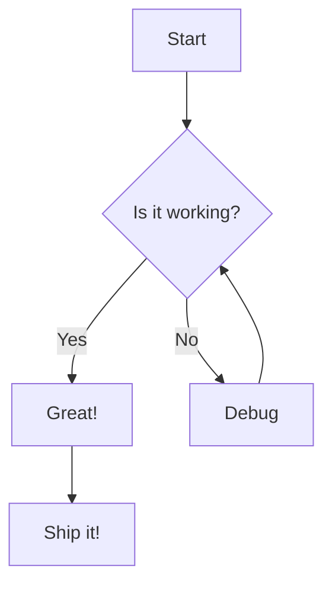
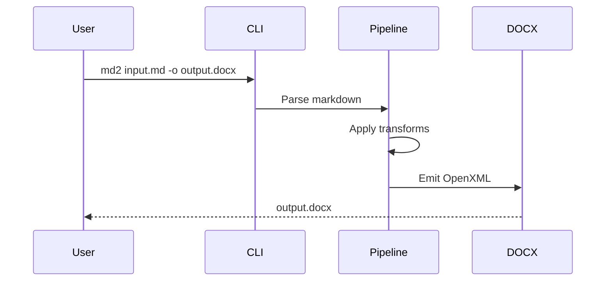

# Feature Showcase

This document exercises **every feature** that md2doc currently supports. It should produce a polished DOCX file that looks noticeably better than pandoc output.

## Text Formatting

Here is **bold text**, *italic text*, ***bold italic***, ~~strikethrough~~, and `inline code`. You can also have [hyperlinks](https://example.com) embedded in a sentence.

A paragraph with a hard
line break in the middle.

## Headings at Every Level

### Third Level Heading

#### Fourth Level Heading

##### Fifth Level Heading

###### Sixth Level Heading

## Smart Typography

This tests "curly quotes" and 'single curly quotes'. It also handles apostrophes in words like don't, can't, and it's.

Dashes: an em dash---like this---and an en dash for ranges like 1--10.

Ellipsis: And then... it just worked.

## Tables

### Simple Table

| Feature       | Status    | Sprint |
|---------------|-----------|--------|
| Parsing       | Done      | 1      |
| DOCX Emission | Done      | 2      |
| Tables        | Done      | 3      |
| Images        | Done      | 3      |
| Lists         | Done      | 3      |
| Code Blocks   | Planned   | 4      |

### Wide Table with Varying Content

| ID | Name                          | Description                                                        | Priority |
|----|-------------------------------|--------------------------------------------------------------------|----------|
| 1  | Short                         | A brief item                                                       | High     |
| 2  | Medium Length Name             | This description is somewhat longer to test column width heuristic | Medium   |
| 3  | A Rather Long Feature Name    | Short desc                                                         | Low      |

## Lists

### Bulleted List

- First item
- Second item with **bold** and *italic*
- Third item with `code`
  - Nested item one
  - Nested item two
    - Deeply nested

### Numbered List

1. Step one
2. Step two
3. Step three
   1. Sub-step A
   2. Sub-step B

### Task List

- [x] Set up project structure
- [x] Implement parsing pipeline
- [x] Add DOCX emission
- [ ] Add code block syntax highlighting
- [ ] Add blockquote support

### Mixed Nesting

1. First ordered item
   - Unordered sub-item
   - Another sub-item
2. Second ordered item
   1. Ordered sub-item
   2. Another ordered sub-item
      - Deep unordered

## Multiple Paragraphs

Lorem ipsum dolor sit amet, consectetur adipiscing elit. Sed do eiusmod tempor incididunt ut labore et dolore magna aliqua. Ut enim ad minim veniam, quis nostrud exercitation ullamco laboris.

Duis aute irure dolor in reprehenderit in voluptate velit esse cillum dolore eu fugiat nulla pariatur. Excepteur sint occaecat cupidatat non proident, sunt in culpa qui officia deserunt mollit anim id est laborum.

## Syntax Highlighting

### C# Example

```csharp
public class Calculator
{
    public double Add(double a, double b) => a + b;

    public async Task<int> ComputeAsync(CancellationToken ct)
    {
        var result = await Task.Run(() => 42, ct);
        return result;
    }
}
```

### Python Example

```python
def fibonacci(n: int) -> list[int]:
    """Generate Fibonacci sequence up to n terms."""
    fib = [0, 1]
    for _ in range(2, n):
        fib.append(fib[-1] + fib[-2])
    return fib[:n]

print(fibonacci(10))
```

## Mermaid Diagrams

### Flowchart



### Sequence Diagram



## Mathematics

### Inline Math

The quadratic formula gives $x = \frac{-b \pm \sqrt{b^2 - 4ac}}{2a}$ for any quadratic equation $ax^2 + bx + c = 0$.

Euler's identity states that $e^{i\pi} + 1 = 0$, connecting five fundamental constants.

### Display Math

The Gaussian integral:

$$
\int_{-\infty}^{\infty} e^{-x^2} \, dx = \sqrt{\pi}
$$

A matrix equation:

$$
\begin{pmatrix} a & b \\ c & d \end{pmatrix} \begin{pmatrix} x \\ y \end{pmatrix} = \begin{pmatrix} ax + by \\ cx + dy \end{pmatrix}
$$

Maxwell's equations in differential form:

$$
\nabla \cdot \mathbf{E} = \frac{\rho}{\varepsilon_0}
$$

## Combined Features

Here's a paragraph with **bold**, *italic*, `code`, and a [link](https://example.com) --- all the inline features together... isn't that "nice"?

| Inline Style   | Example                    |
|----------------|----------------------------|
| Bold           | **This is bold**           |
| Italic         | *This is italic*           |
| Code           | `console.log("hello")`     |
| Link           | [Click here](https://x.com)|
| Strikethrough  | ~~removed~~                |
